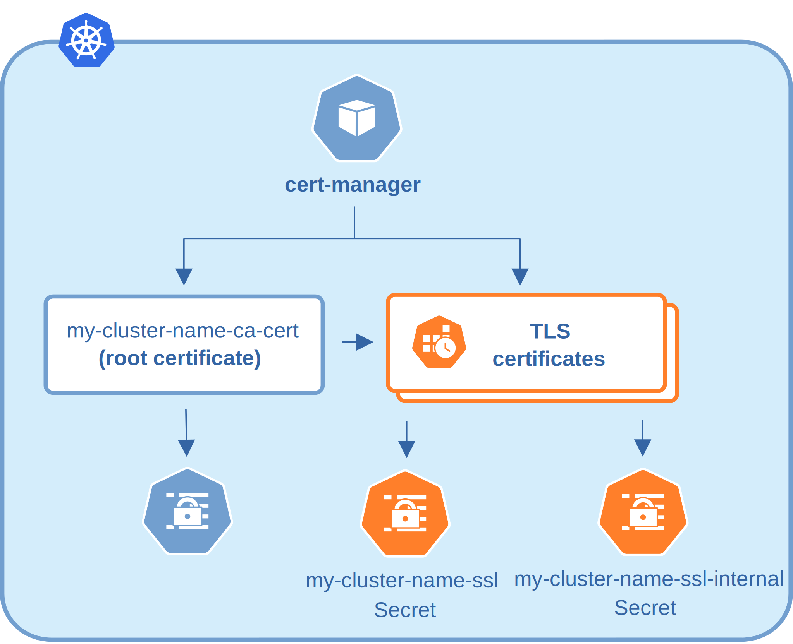

# Transport Layer Security (TLS)

The Percona Operator for MongoDB uses Transport Layer Security (TLS) cryptographic protocol for the following types of communication:

* Internal - communication between Percona Server for MongoDB instances in the cluster
* External - communication between the client application and the cluster

The internal certificate is also used as an authorization method.

TLS usage is controlled by the `tls.mode` Custom Resource
option, which can be set to `allowTLS`, `preferTLS` (default choice),
`requireTLS`, or `disabled`:

```yaml
...
spec:
  ...
  tls:
    mode: preferTLS
```

* `allowTLS` means that both TLS and non-TLS incoming connections are accepted, but server doesn't use TLS internally,
* `preferTLS` turns on TLS for internal communication, and allows both TLS and non-TLS external traffic,
* `requireTLS` **enforces** the use of TLS encrypted connections only,
* `disabled` completely [turns TLS off](#run-percona-server-for-mongodb-without-tls).

Certificates for TLS security can be generated in several ways. By default, the
Operator generates long-term certificates automatically if there are no
certificate secrets available.

Other options are the following ones:

* the Operator can use a specifically installed *cert-manager*, which will
    automatically generate and renew short-term TLS certificates,
* certificates can be generated manually.

!!! note

    The [tls.allowInvalidCertificates](operator.md#tlsallowinvalidcertificates)
    Custom Resource option is set to `true` by default to allow certificates
    automatically generated by the Operator. It can be set to `false` with other
    variants, such as certificates generated by cert-manager.

You can also use pre-generated certificates available in the
`deploy/ssl-secrets.yaml` file for test purposes, but we strongly recommend
**avoiding their usage on any production system**!

The following subsections explain how to configure TLS security with the
Operator yourself, as well as how to temporarily disable it if needed.

Please note that you will need to additionally configure your client application if you are going to use TLS for external traffic. See [this blog post :octicons-link-external-16:](https://www.percona.com/blog/authenticating-your-clients-to-mongodb-on-kubernetes-using-x509-certificates/) for detailed instruction with examples. Also, you can check the [official MongoDB documentation :octicons-link-external-16:](https://www.mongodb.com/docs/manual/tutorial/configure-ssl-clients/). For clients outside of your Kubernetes-based environment, don't forget about [exposing your cluster](expose.md).

## Install and use the *cert-manager*

### About the *cert-manager*

The [cert-manager  :octicons-link-external-16:](https://cert-manager.io/docs/) is a Kubernetes certificate
management controller which widely used to automate the management and issuance
of TLS certificates. It is community-driven, and open source.

When you have already installed *cert-manager* and deploy the operator, the
operator requests a certificate from the *cert-manager*. The *cert-manager* acts
as a self-signed issuer and generates certificates. The Percona Operator
self-signed issuer is local to the operator namespace. This self-signed issuer
is created because Percona Server for MongoDB requires all certificates issued
by the same CA (Certificate authority).

Self-signed issuer allows you to deploy and use the Percona Operator without
creating a cluster issuer separately.

### Installation of the *cert-manager*

The steps to install the *cert-manager* are the following:

* create a namespace,
* disable resource validations on the cert-manager namespace,
* install the cert-manager.

The following commands perform all the needed actions:

``` {.bash data-prompt="$" }
$ kubectl apply -f https://github.com/jetstack/cert-manager/releases/download/v{{ certmanagerrecommended }}/cert-manager.yaml --validate=false
```

After the installation, you can verify the *cert-manager* by running the
following command:

``` {.bash data-prompt="$" }
$ kubectl get pods -n cert-manager
```

The result should display the *cert-manager* and webhook active and running:

``` {.text .no-copy}
NAME                                       READY   STATUS    RESTARTS   AGE
cert-manager-7d59dd4888-tmjqq              1/1     Running   0          3m8s
cert-manager-cainjector-85899d45d9-8ncw9   1/1     Running   0          3m8s
cert-manager-webhook-84fcdcd5d-697k4       1/1     Running   0          3m8s
```

Once you create the database with the Operator, it will automatically trigger
cert-manager to create certificates. Whenever you check certificates for expiration,
you will find that they are valid and short-term.

## Generate certificates manually

!!! warning

    Using manually generated certificates didn't work in the Operator version 1.16.0. The problem is fixed starting from the version 1.16.1.

To generate certificates manually, follow these steps:

1. Provision a Certificate Authority (CA) to generate TLS certificates,
2. Generate a CA key and certificate file with the server details,
3. Create the server TLS certificates using the CA keys, certs, and server details.

The set of commands generate certificates with the following attributes:

* `Server-pem` - Certificate
* `Server-key.pem` - the private key
* `ca.pem` - Certificate Authority

You should generate certificates twice: one set is for external communications,
and another set is for internal ones. A secret created for the external use must
be added to the `spec.secrets.ssl` key of the `deploy/cr.yaml` file. A
certificate generated for internal communications must be added to the
`spec.secrets.sslInternal` key of the `deploy/cr.yaml` file.

You can explore pre-generated / development mode sample certificates available as base64-encoded data in the `deploy/ssl-secrets.yaml` file. Also, check MongoDB certificate requirements in the [upstream documentation :octicons-link-external-16:](https://www.mongodb.com/docs/manual/tutorial/configure-ssl/#member-certificate-requirements).

!!! note

    If you only create the external certificate, then the Operator will not
    generate the internal one, but instead use certificate you have provided for
    both external and internal communications.

Supposing that your cluster name is `my-cluster-name`, the instructions to
generate certificates manually are as follows:

=== "if sharding is off"
    ``` {.bash data-prompt="$" }
    $ CLUSTER_NAME=my-cluster-name
    $ NAMESPACE=default
    $ cat <<EOF | cfssl gencert -initca - | cfssljson -bare ca
      {
        "CN": "Root CA",
        "names": [
          {
            "O": "PSMDB"
          }
        ],
        "key": {
          "algo": "rsa",
          "size": 2048
        }
      }
    EOF
    
    $ cat <<EOF > ca-config.json
      {
        "signing": {
          "default": {
            "expiry": "87600h",
            "usages": ["signing", "key encipherment", "server auth", "client auth"]
          }
        }
      }
    EOF
    
    $ cat <<EOF | cfssl gencert -ca=ca.pem  -ca-key=ca-key.pem -config=./ca-config.json - | cfssljson -bare server
      {
        "hosts": [
          "localhost",
          "${CLUSTER_NAME}-rs0",
          "${CLUSTER_NAME}-rs0.${NAMESPACE}",
          "${CLUSTER_NAME}-rs0.${NAMESPACE}.svc.cluster.local",
          "*.${CLUSTER_NAME}-rs0",
          "*.${CLUSTER_NAME}-rs0.${NAMESPACE}",
          "*.${CLUSTER_NAME}-rs0.${NAMESPACE}.svc.cluster.local"
        ],
        "names": [
          {
            "O": "PSMDB"
          }
        ],
        "CN": "${CLUSTER_NAME/-rs0}",
        "key": {
          "algo": "rsa",
          "size": 2048
        }
      }
    EOF
    $ cfssl bundle -ca-bundle=ca.pem -cert=server.pem | cfssljson -bare server
    
    $ kubectl create secret generic my-cluster-name-ssl-internal --from-file=tls.crt=server.pem --from-file=tls.key=server-key.pem --from-file=ca.crt=ca.pem --type=kubernetes.io/tls
    
    $ cat <<EOF | cfssl gencert -ca=ca.pem  -ca-key=ca-key.pem -config=./ca-config.json - | cfssljson -bare client
      {
        "hosts": [
          "${CLUSTER_NAME}-rs0",
          "${CLUSTER_NAME}-rs0.${NAMESPACE}",
          "${CLUSTER_NAME}-rs0.${NAMESPACE}.svc.cluster.local",
          "*.${CLUSTER_NAME}-rs0",
          "*.${CLUSTER_NAME}-rs0.${NAMESPACE}",
          "*.${CLUSTER_NAME}-rs0.${NAMESPACE}.svc.cluster.local"
        ],
        "names": [
          {
            "O": "PSMDB"
          }
        ],
        "CN": "${CLUSTER_NAME/-rs0}",
        "key": {
          "algo": "rsa",
          "size": 2048
        }
      }
    EOF
    
    $ kubectl create secret generic my-cluster-name-ssl --from-file=tls.crt=client.pem --from-file=tls.key=client-key.pem --from-file=ca.crt=ca.pem --type=kubernetes.io/tls
    ```

=== "if sharding is on"

    ``` {.bash data-prompt="$" }
    $ CLUSTER_NAME=my-cluster-name
    $ NAMESPACE=default
    $ cat <<EOF | cfssl gencert -initca - | cfssljson -bare ca
      {
        "CN": "Root CA",
        "names": [
          {
            "O": "PSMDB"
          }
        ],
        "key": {
          "algo": "rsa",
          "size": 2048
        }
      }
    EOF
    
    $ cat <<EOF > ca-config.json
      {
        "signing": {
          "default": {
            "expiry": "87600h",
            "usages": ["signing", "key encipherment", "server auth", "client auth"]
          }
        }
      }
    EOF
    
    $ cat <<EOF | cfssl gencert -ca=ca.pem  -ca-key=ca-key.pem -config=./ca-config.json - | cfssljson -bare server
      {
        "hosts": [
          "localhost",
          "${CLUSTER_NAME}-rs0",
          "${CLUSTER_NAME}-rs0.${NAMESPACE}",
          "${CLUSTER_NAME}-rs0.${NAMESPACE}.svc.cluster.local",
          "*.${CLUSTER_NAME}-rs0",
          "*.${CLUSTER_NAME}-rs0.${NAMESPACE}",
          "*.${CLUSTER_NAME}-rs0.${NAMESPACE}.svc.cluster.local",
          "${CLUSTER_NAME}-mongos",
          "${CLUSTER_NAME}-mongos.${NAMESPACE}",
          "${CLUSTER_NAME}-mongos.${NAMESPACE}.svc.cluster.local",
          "*.${CLUSTER_NAME}-mongos",
          "*.${CLUSTER_NAME}-mongos.${NAMESPACE}",
          "*.${CLUSTER_NAME}-mongos.${NAMESPACE}.svc.cluster.local",
          "${CLUSTER_NAME}-cfg",
          "${CLUSTER_NAME}-cfg.${NAMESPACE}",
          "${CLUSTER_NAME}-cfg.${NAMESPACE}.svc.cluster.local",
          "*.${CLUSTER_NAME}-cfg",
          "*.${CLUSTER_NAME}-cfg.${NAMESPACE}",
          "*.${CLUSTER_NAME}-cfg.${NAMESPACE}.svc.cluster.local"
        ],
        "names": [
          {
            "O": "PSMDB"
          }
        ],
        "CN": "${CLUSTER_NAME/-rs0}",
        "key": {
          "algo": "rsa",
          "size": 2048
        }
      }
    EOF
    $ cfssl bundle -ca-bundle=ca.pem -cert=server.pem | cfssljson -bare server
    
    $ kubectl create secret generic my-cluster-name-ssl-internal --from-file=tls.crt=server.pem --from-file=tls.key=server-key.pem --from-file=ca.crt=ca.pem --type=kubernetes.io/tls
    
    $ cat <<EOF | cfssl gencert -ca=ca.pem  -ca-key=ca-key.pem -config=./ca-config.json - | cfssljson -bare client
      {
        "hosts": [
          "${CLUSTER_NAME}-rs0",
          "${CLUSTER_NAME}-rs0.${NAMESPACE}",
          "${CLUSTER_NAME}-rs0.${NAMESPACE}.svc.cluster.local",
          "*.${CLUSTER_NAME}-rs0",
          "*.${CLUSTER_NAME}-rs0.${NAMESPACE}",
          "*.${CLUSTER_NAME}-rs0.${NAMESPACE}.svc.cluster.local",
          "${CLUSTER_NAME}-mongos",
          "${CLUSTER_NAME}-mongos.${NAMESPACE}",
          "${CLUSTER_NAME}-mongos.${NAMESPACE}.svc.cluster.local",
          "*.${CLUSTER_NAME}-mongos",
          "*.${CLUSTER_NAME}-mongos.${NAMESPACE}",
          "*.${CLUSTER_NAME}-mongos.${NAMESPACE}.svc.cluster.local",
          "${CLUSTER_NAME}-cfg",
          "${CLUSTER_NAME}-cfg.${NAMESPACE}",
          "${CLUSTER_NAME}-cfg.${NAMESPACE}.svc.cluster.local",
          "*.${CLUSTER_NAME}-cfg",
          "*.${CLUSTER_NAME}-cfg.${NAMESPACE}",
          "*.${CLUSTER_NAME}-cfg.${NAMESPACE}.svc.cluster.local"
        ],
        "names": [
          {
            "O": "PSMDB"
          }
        ],
        "CN": "${CLUSTER_NAME/-rs0}",
        "key": {
          "algo": "rsa",
          "size": 2048
        }
      }
    EOF
    
    $ kubectl create secret generic my-cluster-name-ssl --from-file=tls.crt=client.pem --from-file=tls.key=client-key.pem --from-file=ca.crt=ca.pem --type=kubernetes.io/tls
    ```

!!! note

    Commands in the above example use `rs0` replica set name (the default one). If you set different name in `replsets.name` Custom Resource option, change these commands accordingly.

## Update certificates

If a cert-manager is used, it should take care of
updating the certificates. If you generate certificates manually,
you should take care of updating them in proper time.

TLS certificates issued by cert-manager are short-term ones, valid for 3 months.
They are reissued automatically on schedule and without downtime.



### Check your certificates for expiration

1. First, check the necessary secrets names (`my-cluster-name-ssl` and
    `my-cluster-name-ssl-internal` by default):

    ``` {.bash data-prompt="$" }
    $ kubectl get certificate
    ```

    You will have the following response:

    ``` {.text .no-copy}
    NAME                           READY   SECRET                         AGE
    my-cluster-name-ssl            True    my-cluster-name-ssl            49m
    my-cluster-name-ssl-internal   True    my-cluster-name-ssl-internal   49m
    ```

   This command is available if you have cert-manager installed; if not, you can still check the necessary secrets names with `kubectl get secrets` command.

2. Optionally you can also check that the certificates issuer is up and running:

    ``` {.bash data-prompt="$" }
    $ kubectl get issuer
    ```

    The response should be as follows:

    ``` {.text .no-copy}
    NAME                              READY   AGE
    my-cluster-name-psmdb-issuer      True    61m
    my-cluster-name-psmdb-ca-issuer   True    61m
    ```
    
    Again, this command is provided by cert-manager; if you don't have it installed, you can still use `kubectl get secrets`.

    !!! note

        The presence of two issuers has the following meaning. The
        `my-cluster-name-psmdb-ca-issuer` issuer is used to create a self signed
        CA certificate (`my-cluster-name-ca-cert`), and then the
        `my-cluster-name-psmdb-issuer` issuer is used to create SSL certificates
        (`my-cluster-name-ssl` and `my-cluster-name-ssl-internal`) signed by
        the `my-cluster-name-ca-cert` CA certificate.

3. Now use the following command to find out the certificates validity dates,
    substituting Secrets names if necessary:

    ``` {.bash data-prompt="$" }
    $ {
      kubectl get secret/my-cluster-name-ssl-internal -o jsonpath='{.data.tls\.crt}' | base64 --decode | openssl x509 -noout -dates
      kubectl get secret/my-cluster-name-ssl -o jsonpath='{.data.ca\.crt}' | base64 --decode | openssl x509 -noout -dates
      }
    ```

    The resulting output will be self-explanatory:

    ``` {.text .no-copy}
    notBefore=Apr 25 12:09:38 2022 GMT notAfter=Jul 24 12:09:38 2022 GMT
    notBefore=Apr 25 12:09:38 2022 GMT notAfter=Jul 24 12:09:38 2022 GMT
    ```

### Update certificates without downtime

If you don’t use cert-manager and have *created certificates manually*,
you can follow the next steps to perform a no-downtime update of these
certificates *if they are still valid*.

!!! note

    For already expired certificates, follow the alternative way.

Having non-expired certificates, you can roll out new certificates (both CA and TLS) with the Operator
as follows.

1. Generate a new CA certificate (`ca.pem`). Optionally you can also generate
    a new TLS certificate and a key for it, but those can be generated later on
    step 6.

2. Get the current CA (`ca.pem.old`) and TLS (`tls.pem.old`) certificates
    and the TLS certificate key (`tls.key.old`):

    ``` {.bash data-prompt="$" }
    $ kubectl get secret/my-cluster-name-ssl-internal -o jsonpath='{.data.ca\.crt}' | base64 --decode > ca.pem.old
    $ kubectl get secret/my-cluster-name-ssl-internal -o jsonpath='{.data.tls\.crt}' | base64 --decode > tls.pem.old
    $ kubectl get secret/my-cluster-name-ssl-internal -o jsonpath='{.data.tls\.key}' | base64 --decode > tls.key.old
    ```

3. Combine new and current `ca.pem` into a `ca.pem.combined` file:

    ``` {.bash data-prompt="$" }
    $ cat ca.pem ca.pem.old >> ca.pem.combined
    ```

4. Create a new Secrets object with *old* TLS certificate (`tls.pem.old`)
    and key (`tls.key.old`), but a *new combined* `ca.pem`
    (`ca.pem.combined`):

    ``` {.bash data-prompt="$" }
    $ kubectl delete secret/my-cluster-name-ssl-internal
    $ kubectl create secret generic my-cluster-name-ssl-internal --from-file=tls.crt=tls.pem.old --from-file=tls.key=tls.key.old --from-file=ca.crt=ca.pem.combined --type=kubernetes.io/tls
    ```

5. The cluster will go through a rolling reconciliation, but it will do it
    without problems, as every node has old TLS certificate/key, and both new
    and old CA certificates.

6. If new TLS certificate and key weren’t generated on step 1,
    do that now.

7. Create a new Secrets object for the second time: use new TLS certificate
    (`server.pem` in the example) and its key (`server-key.pem`), and again
    the combined CA certificate (`ca.pem.combined`):

    ``` {.bash data-prompt="$" }
    $ kubectl delete secret/my-cluster-name-ssl-internal
    $ kubectl create secret generic my-cluster-name-ssl-internal --from-file=tls.crt=server.pem --from-file=tls.key=server-key.pem --from-file=ca.crt=ca.pem.combined --type=kubernetes.io/tls
    ```

8. The cluster will go through a rolling reconciliation, but it will do it
    without problems, as every node already has a new CA certificate (as a part
    of the combined CA certificate), and can successfully allow joiners with new
    TLS certificate to join. Joiner node also has a combined CA certificate, so
    it can authenticate against older TLS certificate.

9. Create a final Secrets object: use new TLS certificate (`server.pmm`) and
    its key (`server-key.pem`), and just the new CA certificate (`ca.pem`):

    ``` {.bash data-prompt="$" }
    $ kubectl delete secret/my-cluster-name-ssl-internal
    $ kubectl create secret generic my-cluster-name-ssl-internal --from-file=tls.crt=server.pem --from-file=tls.key=server-key.pem --from-file=ca.crt=ca.pem --type=kubernetes.io/tls
    ```

10. The cluster will go through a rolling reconciliation, but it will do it
    without problems: the old CA certificate is removed, and every node is
    already using new TLS certificate and no nodes rely on the old CA
    certificate any more.

### Update certificates with downtime

If your certificates have been already expired (or if you continue to use the
Operator version prior to 1.9.0), you should move through the
*pause - update Secrets - unpause* route as follows.

1. Pause the cluster [in a standard way](pause.md), and make
    sure it has reached its paused state.

2. If cert-manager is used, delete issuer
    and TLS certificates:

    ``` {.bash data-prompt="$" }
    $ {
      kubectl delete issuer/my-cluster-name-psmdb-ca-issuer issuer/my-cluster-name-psmdb-issuer 
      kubectl delete certificate/my-cluster-name-ssl certificate/my-cluster-name-ssl-internal
      }
    ```

3. Delete Secrets to force the SSL reconciliation:

    ``` {.bash data-prompt="$" }
    $ kubectl delete secret/my-cluster-name-ssl secret/my-cluster-name-ssl-internal
    ```

4. Check certificates to make sure reconciliation have succeeded.

5. Unpause the cluster [in a standard way](pause.md), and make
    sure it has reached its running state.

### Modify certificates generation

There may be reasons to tweak the certificates generation, making it better fit some needs.
Of course, maximum flexibility can be obtained with manual certificates generation,
but sometimes slight tweaking the already automated job may be enough.

The following example shows how to increase CA duration with cert-manager for
a cluster named `cluster1`:

1. Delete the `psmdb` Custom Resource in the proper namespace (this will cause
    deletion of all Pods of the cluster, but later you will recreate the cluster
    using the same `deploy/cr.yaml` flie from which it was originally created).

    !!! note

        you may need to make sure that [`finalizers.percona.com/delete-psmdb-pvc` is not set](operator.md#metadata)
        if you want to preserver Persistent Volumes with the data.

    Deletion command should look as follows:

    ``` {.bash data-prompt="$" }
    $ kubectl -n <namespace_name> delete psmdb cluster1

2. Deletion takes time. Check that all Pods disappear with `kubectl -n <namespace_name> get pods`
    command, and delete certificate related resources:
    
     ``` {.bash data-prompt="$" }
    $ kubectl -n <namespace_name> delete issuer.cert-manager.io/cluster1-psmdb-ca-issuer issuer.cert-manager.io/cluster1-psmdb-issuer certificate.cert-manager.io/cluster1-ssl-internal certificate.cert-manager.io/cluster1-ssl certificate.cert-manager.io/cluster1-ca-cert secret/cluster1-ca-cert secret/cluster1-ssl secret/cluster1-ssl-internal
    ```

3. Create your own custom CA:

    ```yaml  title="my_new_ca.yml"
    apiVersion: cert-manager.io/v1
    kind: Issuer
    metadata:
      name: cluster1-psmdb-ca-issuer
    spec:
      selfSigned: {}
    ---
    apiVersion: cert-manager.io/v1
    kind: Certificate
    metadata:
      name: cluster1-ca-cert
    spec:
      commonName: cluster1-ca
      duration: 10000h0m0s
      isCA: true
      issuerRef:
        kind: Issuer
        name: cluster1-psmdb-ca-issuer
      renewBefore: 730h0m0s
      secretName: cluster1-ca-cert
    ```

    Apply it as usual, with the `kubectl -n <namespace_name> apply -f my_new_ca.yml` command.

4. Recreate the cluster from the original `deploy/cr.yaml` configuration file:

    ``` {.bash data-prompt="$" }
    $ kubectl -n <namespace_name> apply -f deploy/cr.yaml
    ```

5. Verify certificate duration [in usual way](TLS.md#check-your-certificates-for-expiration).

## Run Percona Server for MongoDB without TLS

Omitting TLS is also possible, but we recommend that you run your cluster with
the TLS protocol enabled.

To disable TLS protocol (e.g. for demonstration purposes) set the
`tls.mode` key to `disabled` and set `unsafeFlags.tls`
to `true` in the `deploy/cr.yaml`:
file.

```yaml
...
spec:
  ...
  unsafeFlags
    tls: true
    ...
  tls:
    mode: disabled
```

