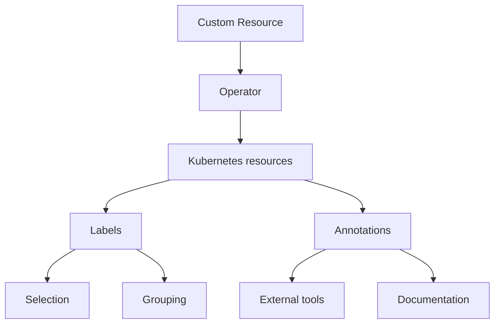

# Labels and annotations

Labels and annotations are rather similar but differ in purpose.

**Labels** are used by Kubernetes to identify and select objects. They enable filtering and grouping, allowing users to apply selectors for operations like deployments or scaling.

**Annotations** are assigning additional *non-identifying* information that doesn't affect how Kubernetes processes resources. They store descriptive information like deployment history, monitoring configurations or external integrations.

The following diagram illustrates this difference:



Both Labels and Annotations are assigned to the following objects:

* Custom Resource Definitions
* Custom Resources
* Deployments
* Services
* StatefulSets
* PVCs
* Pods
* ConfigMaps and Secrets
* Backup jobs for scheduled backups

## When to use labels and annotations

Use **Labels** when:

* The information is used for object selection
* The data is used for grouping or filtering
* The information is used by Kubernetes controllers
* The data is used for operational purposes

Use **Annotations** when:

* The information is for external tools
* The information is used for debugging
* The data is used for monitoring configuration

## Labels and annotations used by Percona Operator for MongoDB

### Labels

| Name                        | Objects                          | Description                                      | Example values                          |
|-----------------------------|-----------------------------------|------------------------------------------------|-----------------------------------------|
| `app.kubernetes.io/name`      | Services, StatefulSets, Deployments, etc. | Specifies the name of the application for selectors and grouping  | percona-server-mongodb |
| `app.kubernetes.io/instance`  | Pods, Services, StatefulSets, Deployments | Identifies a specific instance of the application | my-cluster-name |
| `app.kubernetes.io/managed-by`| Services, StatefulSets           | Indicates the controller managing the object    | percona-server-mongodb-operator |
| `app.kubernetes.io/component`| Pods, Services, StatefulSets           | Specifies the component within the application  | mongod, mongos, arbiter, external-service , crd                 |
| `app.kubernetes.io/part-of`   | Services, StatefulSets           | Indicates the higher-level application the object belongs to | percona-server-mongodb          |
| `app.kubernetes.io/version`  | CustomResourceDefinition          | Specifies the version of the Percona Server for MongoDB Operator. | v{{release}} |
| `app.kubernetes.io/replset`  | CustomResourceDefinition          | Specifies replica set name in Percona Server for MongoDB Operator. | rs0 |
| `percona.com/backup-ancestor`| Custom Resource | Specifies the name of the backup that was used as a base for the current backup | my-cluster-name-backup-2025-05-23 |
| `percona.com/backup-type`| Custom Resource | Specifies the type of backup being performed (e.g. cron for scheduled backups) | cron |
| `percona.com/cluster` | Custom Resource | Identifies the MongoDB cluster instance | my-cluster-name |
| `rack` | Pods, Services, Deployments, StatefulSets| Identifies topology or rack awareness, often for scheduling or affinity | `rack-22`|

### Annotations

| Name            | Associated resources       | Description                 | Example values         |
|-----------------|----------------------------|-----------------------------|------------------|
| `iam.amazonaws.com/role`  | Pod, PVC, Service              | Assigns an AWS IAM role to the resource for permissions.         | `role-arn`        |               |
| `service.beta.kubernetes.io/aws-load-balancer-backend-protocol` | Service                       | Specifies protocol for AWS load balancer backend.                | `http`            |
| `percona.com/last-applied-tls` | Services   | Stores the hash of the last applied TLS configuration for the service |
| `percona.com/last-applied-secret` | Secrets | Stores the hash of the last applied user Secret configuration |
| `percona.com/configuration-hash` | Services | Used to track and validate configuration changes in the MySQL cluster components | `percona.com/last-applied-secret: "hashvalue"`|
| `percona.com/last-config-hash` | Services | Stores the hash of the most recent configuration |
| `percona.com/ssl-hash` | Pods | Stores the hash of the most recent TLS configuration | 
| `percona.com/ssl-internal-hash` | Pods | Stores the hash of the most recent TLS configuration for internal communication |
| `percona.com/passwords-updated`| Secrets | Indicates when passwords were last updated in the Secret |

## Setting labels and annotations in the Custom Resource

You can define both Labels and Annotations as `key-value` pairs in the metadata section of a YAML manifest for a specific resource. 

### Set labels and annotations for Pods

To specify labels and annotations for Percona Server for MongoDB Pods, use the `replsets.<name>.annotations` /`replsets.<name>.labels`, `sharding.configsvrReplSet.annotations` / `sharding.configsvrReplSet.labels` and `sharding.mongos.annotations` / `sharding.mongos.labels` options in the `deploy/cr.yaml` Custom Resource. The example configuration for Percona Server for MongoDB database instances looks as follows:

```yaml
apiVersion: psmdb.percona.com/v1
kind: PerconaServerMongoDB
spec:
  replsets:
  - name: rs0
    annotations:
      iam.amazonaws.com/role: role-arn
    labels:
      rack: rack-22 
    ...
```

### Set labels and annotations for Services

To annotate Services, use the `replsets.<name>.expose.annotations` / `replsets.<name>.expose.labels`, `sharding.configsvrReplSet.expose.annotations` / `sharding.configsvrReplSet.expose.labels` and `sharding.mongos.expose.annotations` / `sharding.mongos.expose.labels` options in the `deploy/cr.yaml` Custom Resource. The example configuration for `mongos` is:

```yaml
spec:
  sharding:
    mongos:
      expose:
        annotations:
          service.beta.kubernetes.io/aws-load-balancer-backend-protocol: http
        labels:
          rack: rack-22
```

## Querying labels and annotations

To check which **labels** are attached to a specific object, use the additional `--show-labels` option of the `kubectl get` command.

For example, to see the Operator version associated with a Custom Resource Definition, use the following command:

```{.bash data-prompt="$"}
$ kubectl get crd perconaservermongodbs.psmdb.percona.com --show-labels
```

??? example "Sample output"

    ```{.text .no-copy}
    NAME                                      CREATED AT             LABELS
    perconaservermongodbs.psmdb.percona.com   2025-09-18T08:27:53Z   app.kubernetes.io/component=crd,app.kubernetes.io/name=percona-server-mongodb,app.kubernetes.io/part-of=percona-server-mongodb-operator,app.kubernetes.io/version=v{{release}}
    ```

To check **annotations** associated with an object, use the following command:

``` {.bash data-prompt="$" }
$ kubectl get <resource> <resource-name> -o jsonpath='{.metadata.annotations}'
```

For example:

``` {.bash data-prompt="$" }
$ kubectl get pod my-cluster-name-rs0-0 -o jsonpath='{.metadata.annotations}'
```

## Specifying labels and annotations ignored by the Operator

Sometimes various Kubernetes flavors can add their own annotations to the
objects managed by the Operator.

The Operator keeps track of all changes to its objects and can remove
annotations that it didn't create.
If there are no annotations or labels in the Custom Resource expose subsections,
the Operator does nothing if a new label or annotation is added to the object.

If the [Service per Pod](expose.md#service-per-pod) mode is not used, the
Operator **won't remove any annotations and labels** from any Services related
to *this expose subsection*. Though, it is still possible to add annotations and
labels via the Custom Resource in this case. Use the appropriate
`expose.serviceAnnotations` and `expose.serviceLabels` fields.

Else, if the [Service per Pod](expose.md#service-per-pod) mode is active, the
Operator removes unknown annotations and labels from Services
*created by the Operator for Pods*. 

Yet it is still possible to specify which
annotations and labels should be preserved (not wiped out) by the Operator. It is useful if a cloud provider adds own labels and annotations. Or you may have custom automation tools that add own labels or annotations and you need to keep them.

List
these labels and annotations in the `spec.ignoreAnnotations` or `spec.ignoreLabels` fields of the
`deploy/cr.yaml`, as follows:

```yaml
spec:
  ignoreAnnotations:
    - some.custom.cloud.annotation/smth
  ignoreLabels:
    - some.custom.cloud.label/smth
...
```
