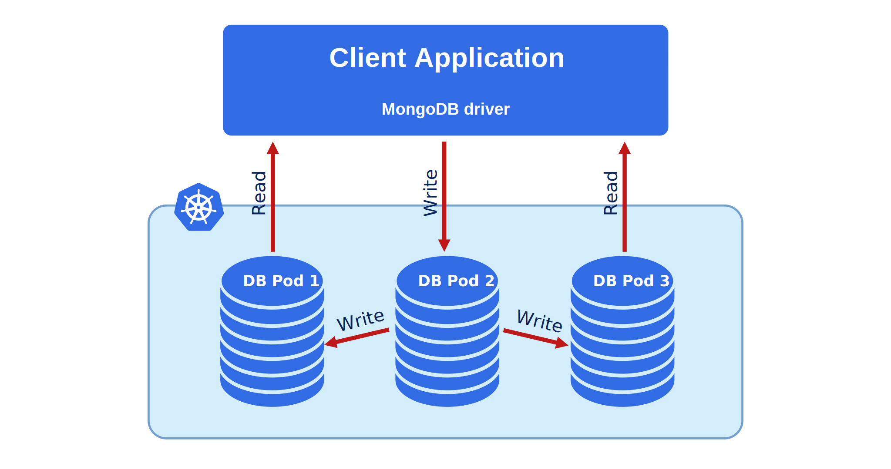
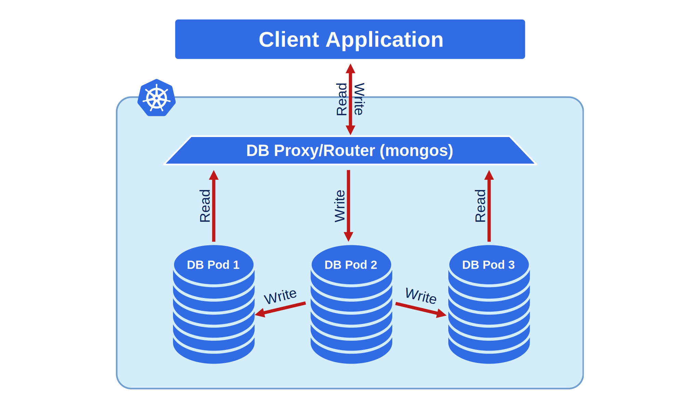
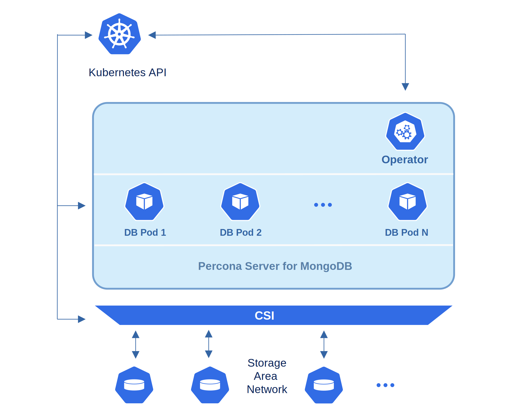

# Design and architecture

The Percona Operator for MongoDB automates deploying and operating Percona Server for MongoDB on Kubernetes. This document explains what components the Operator uses and how they work together to provide a highly available MongoDB database. See also [How the Operator works](how-it-works.md).

## Components

The StatefulSet, deployed with the Operator includes the following components:

* **Percona Server for MongoDB** - a drop-in replacement for MongoDB Community Server with enterprise-grade features. Each replica set member runs as a `mongod` process in its own Pod. The Operator deploys these Pods via a StatefulSet so that each member has a stable network identity and a PersistentVolume for data. You can run one or more replica sets; in a sharded cluster, each shard is a replica set.

* **Percona Backup for MongoDB (PBM)** - an open-source backup and restore solution for Percona Server for MongoDB, MongoDB Community and Advanced Edition with guaranteed data consistency. When you [configure backup storage](backups-storage.md), the Operator runs PBM as a [sidecar container](sidecar.md) in each database Pod. PBM performs logical or physical backups and uploads them to the configured storage. Read more about backups, their supported types and workflow in [About backups](backups.md).

* **mongos** (sharded clusters only) - is the query router that acts as the entry point to the sharded cluster for client applications. Clients connect to mongos, which routes queries to the appropriate shard(s). The Operator deploys mongos via a StatefulSet; you control the number of mongos replicas in the custom resource.

* **Config server replica set** (sharded clusters only) - a special replica set that stores cluster metadata and configuration.  Config servers run `mongod` process with a dedicated role; see [Sharding](sharding.md) for configuration options.

It can also include [sidecar containers](sidecar.md) that you can add to replica set, config server, or mongos Pods. Examples of sidecar containers are Percona Monitoring and Management (PMM) client for [monitoring](monitoring.md), or custom exporters and tools. The Operator supports multiple sidecars per Pod with configurable images, commands, and volume mounts.

## Percona Server for MongoDB topology

The design of the Operator is tied to the Percona Server for MongoDB replica set and sharded cluster model.

### Replica set

A replica set consists of one primary and one or more secondary nodes. The primary accepts writes; secondaries replicate data and can serve reads. The following diagram shows a simple replica set.

Client applications connect to the replica set using a MongoDB driver and a `mongodb+srv` connection string.

### Sharded cluster

When you need horizontal scaling, you enable sharding. Each shard is a replica set holding a subset of the data. The **mongos** query router is the entry point for clients; **config servers** store sharding metadata. A simplified view:

For details, see [Percona Server for MongoDB Sharding](sharding.md).

By default, the Operator creates Percona Server for MongoDB replica set with three members, one primary and the remaining secondaries. This is the minimal recommended configuration. A replica set can have up to 50 members with the maximum of 7 voting members.

## High availability

The Operator supports high availability through replica set topology, Pod distribution, automatic recovery, and client connectivity.

### Pod distribution

The Operator uses [node affinity and anti-affinity](constraints.md) to spread MongoDB Pods across separate worker nodes when possible. That way a single node failure does not take down multiple replica set members. You can tune affinity rules in the PerconaServerMongoDB custom resource.

### Automatic recovery

- **Node or Pod failure** — Kubernetes reschedules the Pod on another healthy node. The mongod process starts and rejoins the replica set. If the failed node was the primary, the replica set holds an [election](https://www.mongodb.com/docs/manual/core/replica-set-elections/) and promotes a secondary to primary.
- **Operator failure** — If the node running the Operator fails, Kubernetes restarts the Operator on another node. The Operator resumes watching PerconaServerMongoDB resources and reconciling state.

The database cluster is deployed as a replica set with at least three nodes (or as a sharded cluster whose shards and config servers are replica sets), so there is no single point of failure for the data path.

### Client connectivity

Applications should use a **mongodb+srv** connection URI. MongoDB drivers (4.2 and later) discover replica set members from DNS SRV records, so you do not need to list hostnames for dynamically assigned Pods. The Operator creates the necessary Services and DNS entries for the replica set.

!!! note

    The Operator applies security settings that are stricter than default Percona Server for MongoDB. The initial configuration includes default passwords for required user accounts; change them in production as described in the [installation instructions](System-Requirements.md#installation-guidelines).

## What to read next

- [About backups](backups.md) — How backups and restores work with PBM
- [Scale the cluster](scaling.md) — Scale your cluster vertically or horizontally
* [Control Pod placement](constraints.md) — Configure anti-affinity and pod distribution
* [Upgrade the Operator and database](update.md) — Keep your cluster up to date
* [Custom Resource options](operator.md) — Description of available configuration options
