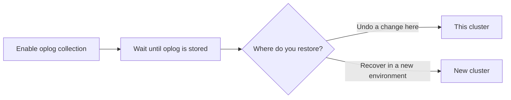

# Enable point-in-time recovery (PITR)

Point-in-time recovery rolls the cluster back to a specific date and time. The Operator restores a full backup, then applies oplog on top of it. For what PITR supports and when to use it, see [Point-in-time recovery](backups.md#point-in-time-recovery).

## Before you begin

* [Configure backup storage](backups-storage.md). PBM saves oplog to that storage.
* You must have a successful backup (full logical, physical or incremental base) to serve as the base for oplog collection. Without one, Percona Backup for MongoDB does not upload oplog. Take a backup for a new cluster and after you restore from a backup. See [Make a backup](backups-ondemand.md).

## Enable oplog collection

Set [backup.pitr.enabled](operator.md#backuppitrenabled) in `deploy/cr.yaml`:

```yaml
backup:
  ...
  pitr:
    enabled: true
```

After you enable point-in-time recovery, it takes 10 minutes for the first oplog chunk to be uploaded. The default interval is 10 minutes. Change it with `backup.pitr.oplogSpanMin`.

## Multiple storages

=== "Version 1.20.0 and above"

    You can enable point-in-time recovery and take backups on a storage of your choice. PBM saves oplog only to the [main storage](multi-storage.md) so data stays consistent. You can then [restore to a point in time](backups-pitr-restore.md) from any backup on any storage.

=== "Version 1.19.1 and earlier"

    You must have a single storage in [spec.backup.storages](operator.md#backupstoragesstorage-nametype). PBM writes oplog to the same bucket as the backup snapshot. If you define several storages and enable PITR, PBM cannot guarantee consistency, so the Operator does not allow it. You will see an error in the Operator logs.

## Restore options

You can restore your database on the same cluster or on a new cluster. Choose your restore path.

* **This cluster** — undo a bad write, or other change on this cluster. 
* **New cluster** — restore that same point in time into another Kubernetes environment. Use this for disaster recovery or when you want to leave the source cluster running.

PVC snapshot (`external`) backups do not support this restore.



To restore a single collection under a different name to a given time, see [Point-in-time recovery with namespace remapping](backups-restore-new-name.md#point-in-time-recovery-with-namespace-remapping).

## Next steps

[Restore to a point in time](backups-pitr-restore.md){.md-button}
