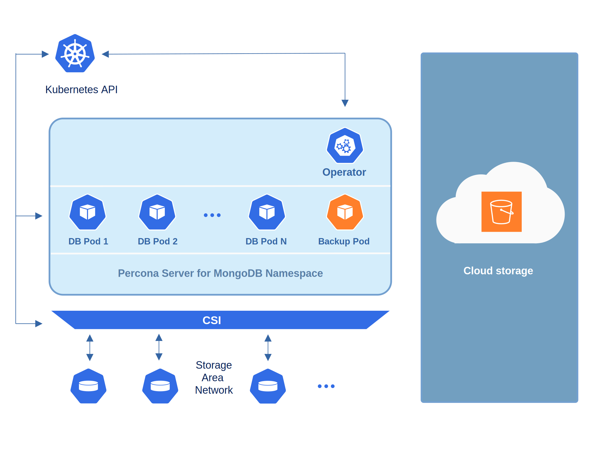

# About backups

You can back up your data in two ways:

* *On-demand*. You can do them manually at any moment.
* *Scheduled backups*. Configure backups and their schedule in the [deploy/cr.yaml  :octicons-link-external-16:](https://github.com/percona/percona-server-mongodb-operator/blob/main/deploy/cr.yaml). The Operator makes them automatically according to the specified schedule.

To make backups and restores, the Operator uses the [Percona Backup for MongoDB (PBM) :octicons-link-external-16:](https://github.com/percona/percona-backup-mongodb) tool. The Operator runs PBM as [a sidecar container](sidecar.md) to the database Pods. It configures PBM in the following cases:

* when it creates a new cluster if you defined the [backup storage configuration](backups-storage.md) for it. 
* when you configure the backup storage for a backup 
* when you [start a restore on a new cluster](backups-restore-to-new-cluster.md) and defined the backup storage configuration within the `backupSource` subsection of the Restore resource. 

## How backup and restore work

`pbm-agent` processes running as sidecar containers in every database Pod watch the PBM control collections and react on changes. Read more about the control collections in the [PBM documentation :octicons-link-external-16:](https://docs.percona.com/percona-backup-mongodb/details/control-collections.html). 

When a new document is added to PBM control collections, one of the `pbm-agent` processes starts a backup or a restore operation. This `pbm-agent` is randomly chosen among the secondary nodes. For more details on how the election process works, refer to the [PBM documentation :octicons-link-external-16:](https://docs.percona.com/percona-backup-mongodb/details/pbm-agent.html).

### Backup flow

When you create a backup object, the Operator adds a new document to the PBM control collections. All `pbm-agent` processes continuously monitor these collections for changes. When a new backup request appears, one of the `pbm-agent` processes on secondary MongoDB nodes starts making a backup. 

The `pbm-agent` reads the backup type from the document, copies data based on the backup type and uploads it to the configured storage:

   * Logical backup: PBM reads database data and uploads it.
   * Physical backup: PBM copies data files from `dbPath` and uploads them.

### Restore flow

The restore flow depends on the backup type:

**From logical backup**

When you create the Restore object, the following occurs:

1. The Operator writes a new document into the PBM control collections.
2. The Operator shuts down `mongos` Pods (for sharded clusters) so that clients cannot access the database when the restore is in progress.
2. A `pbm-agent` restores data from the backup into the corresponding collections.
3. For a selective restore, PBM restores only the specified namespaces.
4. For point-in-time recovery, PBM replays oplog chunks on top of the restored data to bring the database to the time defined in the `restore_to_time` field.

**From physical backup**

To restore the database from a physical backup, a `pbm-agent` requires the access to the `mongod` binaries. Therefore, when you create the Restore object, the following occurs:

1. The Operator prepares the cluster:

   * It terminates `mongos` Pods (for sharded clusters) to prevent the clients from accessing the database when the restore is in progress.
   * It terminates arbiter nodes.
   * It updates the StatefulSet by moving PBM binaries into the `mongod` container and removes the PBM sidecar. This triggers a rolling restart of the database Pods.
   * It triggers the restore using the PBM CLI.
   
2. The restore is made by the `pbm-agent` process running inside the `mongod` container.
3. The `pbm-agent` wipes the `dbPath`, downloads the backup files from the storage, and copies the files into the data directory. It also applies oplog chunks from the backup snapshot to maintain data consistency.
4. PBM triggers several restarts during the restore.
5. After a successful restore, the Operator recreates the StatefulSet with the regular configuration so PBM runs as a sidecar again. All database Pods are terminated and recreated. The Operator also restarts arbiter nodes and `mongos` Pods.

**Point-in-time recovery from a physical backup**

1. The Operator follows the same preparation steps as for a physical restore.
2. It ensures that Pod 0 is the primary. If it is not, the Operator makes it primary and waits for it to report the `PRIMARY` status.
3. PBM restores the backup and then applies oplog chunks to reach the target time.
4. After the successful restore, the Operator recreates the StatefulSet with its regular configuration.

For hands-on steps, see [Restore the cluster from a previously saved backup](backups-restore.md).

### Backup retention

Each backup object has the `delete-backup` finalizer, so deleting the object also removes the backup files from storage. You can control how many backups to keep with the [backup.tasks.retention](operator.md#backuptasksretention) retention setting. For details, see [Configure retention policy](backups-scheduled#configure-retention-policy.md).

## Backup storage

You can store Percona Server for MongoDB backups outside the Kubernetes
cluster using the following remote backup storages: 

* [Amazon S3 or S3-compatible storage  :octicons-link-external-16:](https://en.wikipedia.org/wiki/Amazon_S3#S3_API_and_competing_services),
* [MinIO :octicons-link-external-16:](https://min.io/) S3-compatible storage
* [Azure Blob Storage  :octicons-link-external-16:](https://azure.microsoft.com/en-us/services/storage/blobs/)

### Multiple backup storages

Starting with version 1.20.0, the Operator natively supports [multiple backup storages :octicons-link-external-16:](https://docs.percona.com/percona-backup-mongodb/features/multi-storage.html), inheriting this feature from Percona Backup for MongoDB (PBM). This means you don't have to wait till the Operator reconfigures a cluster after you select a different storage for a backup or a restore. And you can make a point-in-time recovery from any backup stored on any storage - PBM and the Operator maintain the data consistency for you.

Find more information in the [Multiple storages for backups](multi-storage.md) chapter. 

## Backup types

| Backup type | Version added | Status | Description | Important considerations |
|------------|---------------|---------|-------------|-------------------------|
| Full logical | Initial | GA | Queries Percona Server for MongoDB for database data and writes this data to the remote storage | - Uses less storage but is slower than physical backups - Supports selective restore since [1.18.0](RN/Kubernetes-Operator-for-PSMONGODB-RN1.18.0.md) - Supports point-in-time recovery  - Incompatible for restores with backups made with Operator versions before 1.9.0. Make a new backup after the upgrade to the Operator 1.9.0. |
| Full physical | [1.14.0](RN/Kubernetes-Operator-for-PSMONGODB-RN1.14.0.md) | GA ([1.16.0](RN/Kubernetes-Operator-for-PSMONGODB-RN1.16.0.md)) | Copies physical files from MongoDB `dbPath` data directory to remote storage | - Faster backup/restore than logical - Better for large datasets - Supports point-in-time recovery since [1.15.0](RN/Kubernetes-Operator-for-PSMONGODB-RN1.15.0.md)|
| Physical incremental | [1.20.0](RN/Kubernetes-Operator-for-PSMONGODB-RN1.20.0.md) | Tech preview | Copies only data changed after the previous backup | - Speeds up backup/restore - Reduces network load and storage consumption - Requires a base incremental backup to start the incremental chain  - Base backup and increments must bet taken from the same node - New base backup is needed if a node is down or if the cluster was restored from a backup|

