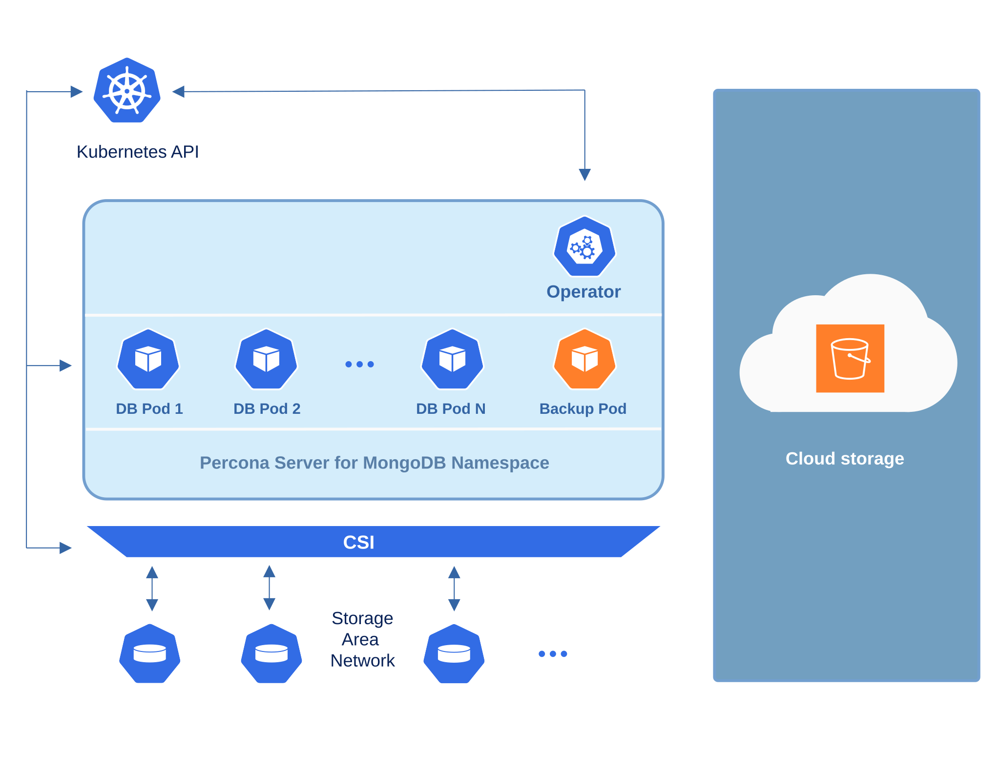

# Backup and restore

The Operator uses [Percona Backup for MongoDB (PBM) :octicons-link-external-16:](https://github.com/percona/percona-backup-mongodb) to back up and restore Percona Server for MongoDB. PBM runs as a [sidecar](sidecar.md) in your database Pods.

Use this page to choose a backup type, storage, restore method, and whether you need point-in-time recovery. For the internal workflow, see How backup and restore work below.

??? note "How backup and restore work"
    
    The Operator configures PBM when it creates a cluster that already has [backup storage](backups-storage.md), when you add storage later, or when you [restore on a new cluster](backups-restore-to-new-cluster.md) and pass storage in `backupSource`.

    A `pbm-agent` process in every database Pod watches PBM [control collections :octicons-link-external-16:](https://docs.percona.com/percona-backup-mongodb/details/control-collections.html). When a new document appears, one agent is elected among secondaries and starts the backup or restore. See the [PBM agent documentation :octicons-link-external-16:](https://docs.percona.com/percona-backup-mongodb/details/pbm-agent.html) for the election process.

    ### Backup flow

    When you create a Backup object, the Operator adds a document to the control collections. An agent on a secondary reads the backup type and copies accordingly:

    * **Logical** — reads database data and uploads it to storage.
    * **Physical** — copies files from `dbPath` and uploads them.
    * **Physical incremental** - copies only the data that changed after the previous backup in the chain. Base and increments must be taken from the same node.
    * **External (PVC snapshot)** — PBM prepares the database for a consistent copy and the Operator creates CSI `VolumeSnapshot` objects for each data PVC.

        PBM opens a [`$backupCursor` :octicons-link-external-16:](https://docs.percona.com/percona-backup-mongodb/usage/backup-external.html#procedure), stores metadata on remote storage, and waits until nodes are `copyReady`. The Operator then snapshots each `mongod-data` PVC. After snapshots are `readyToUse`, PBM closes the cursor and marks the backup complete. The Backup resource lists each replica set and snapshot name in the `status.snapshots` field .

    ### Restore flow

    **From logical backup**

    1. The Operator writes a restore document to the control collections.
    2. It shuts down `mongos` Pods (sharded clusters) so clients cannot use the database during the restore.
    3. A `pbm-agent` restores data into the corresponding collections.
    4. For a selective restore, PBM restores only the specified namespaces.
    5. For point-in-time recovery, PBM replays oplog up to `restore_to_time`.

    **From physical backup**

    A `pbm-agent` needs access to `mongod` binaries, so the Operator prepares the cluster first:

    1. It terminates `mongos` Pods (sharded clusters) and arbiter nodes, moves PBM binaries into the `mongod` container, removes the PBM sidecar (rolling restart), and starts the restore with the PBM CLI.
    2. The agent inside the `mongod` container wipes `dbPath`, downloads backup files, copies them into the data directory, and applies oplog from the snapshot for consistency.
    3. PBM restarts `mongod` as it moves through restore phases.
    4. After a successful restore, the Operator recreates the StatefulSet so PBM runs as a sidecar again, then restarts database, arbiter, and `mongos` Pods.

    **From PVC snapshot (`external`) backup**

    Snapshot restores use PBM’s [external restore :octicons-link-external-16:](https://docs.percona.com/percona-backup-mongodb/usage/restore-external-agent-restart.html) workflow. At **`copyReady`**, `mongod` is stopped and data directories are empty, so the Operator recreates PVCs from volume snapshots and runs `pbm-agent restore-finish` before PBM can complete the restore.

    1. The Operator terminates `mongos` and arbiter nodes, prepares StatefulSets as for a physical restore, and starts `pbm restore --external`.
    2. PBM shuts down `mongod`, wipes `dbPath`, and leaves nodes in **`copyReady`**.
    3. The Operator scales StatefulSets to zero and runs `pbm-agent restore-finish` on every node with PBM config, replica set name, node name, and (when needed) MongoDB `db` config for encryption at rest.
    4. It recreates each data PVC from the `VolumeSnapshot` in the backup or in `backupSource.snapshots`, one PVC at a time.
    5. It scales StatefulSets back up and runs `pbm restore-finish` so PBM applies metadata and brings the cluster to a consistent state.
    6. After success, it cleans up temporary restore configuration and returns the cluster to normal operation.

    For steps, see [Restore from a PVC snapshot](backups-pvc-usage.md#make-an-in-place-restore-from-a-pvc-snapshot-backup).

    **Point-in-time recovery from a physical backup**

    1. The Operator follows the same preparation as for a physical restore.
    2. It makes sure Pod 0 is primary.
    3. PBM restores the backup, then applies oplog to the target time.
    4. After success, the Operator recreates the StatefulSet with its regular configuration.

    For steps, see [Restore to a point in time](backups-pitr-restore.md).

    

## Choose a path

| Goal | Use | Next step |
| --- | --- | --- |
| Nightly or scheduled protection | Scheduled logical or physical backup | [Configure storage](backups-storage.md), then [scheduled backup](backups-scheduled.md) |
| A one-off copy before a change | On-demand backup | [Configure storage](backups-storage.md), then make an [on-demand backup](backups-ondemand.md) |
| Large dataset, fast backup and restore | PVC snapshot (`external`) | [Configure PVC snapshots](backups-pvc-setup.md) |
| Undo a bad write to a specific time | Point-in-time recovery (PITR) (logical or physical only) | [Enable PITR](backups-pitr.md), then [restore to a point in time](backups-pitr-restore.md) |
| Clone data to another environment | Restore to a new cluster | [Restore on a new cluster](backups-restore-to-new-cluster.md) |
| Restore one database or collection | Selective restore from a logical backup | [Restore on the same cluster](backups-restore.md#selective-restore) |

## Backup types

You can run backups on a schedule or on demand. Starting with version 1.23.0, you can also use Kubernetes volume snapshots.

| Backup type | Version added | Status | Description | Use this when | Constraints |
| --- | --- | --- | --- | --- | --- |
| Full logical | Initial | GA | Queries the database and writes the data to remote storage | You want portability or [selective restore](backups-restore.md#selective-restore) | Uses less storage but is slower than physical backups. Supports point-in-time recovery. Incompatible with backups made with Operator versions before 1.9.0 — take a new backup after upgrading. |
| Full physical | [1.14.0](RN/Kubernetes-Operator-for-PSMONGODB-RN1.14.0.md) | GA in [1.16.0](RN/Kubernetes-Operator-for-PSMONGODB-RN1.16.0.md) | Copies files from MongoDB `dbPath` to remote storage | You have a large dataset and need faster restore | Supports point-in-time recovery since [1.15.0](RN/Kubernetes-Operator-for-PSMONGODB-RN1.15.0.md). |
| Physical incremental | [1.20.0](RN/Kubernetes-Operator-for-PSMONGODB-RN1.20.0.md) | Tech preview | Copies only data changed after the previous backup | You want smaller, faster follow-up backups | Needs a base incremental backup. Base and increments must be taken from the same node. Take a new base backup if a node goes down or after a restore. Deleting a base also deletes its increments from storage. |
| PVC snapshot (`external`) | [1.23.0](RN/Kubernetes-Operator-for-PSMONGODB-RN1.23.0.md) | GA | PBM prepares the database; the Operator creates CSI volume snapshots of data PVCs | You need the fastest backup and restore for large volumes | No data upload to object storage. No point-in-time recovery or selective restore. Requires the Volume Snapshot API and a `VolumeSnapshotClass`. |

[Configure backups](backups-configure.md){.md-button}

## Backup storage

### Supported storages

Store backups outside the Kubernetes cluster on one of these remote storages:

* [Amazon S3](backups-storage-s3.md)
* [Google Cloud Storage](backups-storage-gcp.md)
* [MinIO and S3-compatible storages](backups-storage-minio.md)
* [Microsoft Azure Blob storage](backups-storage-azure.md)
* [Alibaba Cloud OSS](backups-storage-oss.md)
* [Oracle Cloud Infrastructure Object Storage](backups-storage-oci.md)
* [Remote file server](backups-storage-filesystem.md)

### Multiple storages

Starting with version 1.20.0, you can define [multiple backup storages](multi-storage.md). You can take a backup or restore from any configured storage without waiting for the Operator to reconfigure the cluster. Point-in-time recovery from any storage is supported because PBM keeps oplog on the main storage.

### Storage for snapshot metadata

PVC snapshots keep the data on the storage backend. You still need at least one entry in `backup.storages` so PBM can save **backup metadata** (including encryption-related information). Snapshot backups do not upload database files to that storage.

[Configure storage](backups-storage.md){.md-button}

## Restore options

You can restore:

* On the [same cluster](backups-restore.md)
* On a [new cluster](backups-restore-to-new-cluster.md)
* On a [new cluster with different replica set names](backups-restore-replset-remapping.md)
* A [collection under a different name](backups-restore-new-name.md) (logical backups, replica set only)
* Selected namespaces from a full logical backup ([selective restore](backups-restore.md#selective-restore))

Use `backupName` when the Backup object still exists in the cluster. Use `backupSource` when it does not — for example, when you restore to a new cluster.

[Restore from a backup](backups-restore.md){.md-button}

## Point-in-time recovery

Point-in-time recovery rolls the cluster back to a specific date and time. The Operator restores a full backup, then replays the operations log (oplog) up to that moment.

You can use PITR with logical and physical backups from Operator [1.15.0](RN/Kubernetes-Operator-for-PSMONGODB-RN1.15.0.md) onward. PVC snapshot (`external`) backups do **not** support PITR.

You need:

* PITR enabled so the Operator saves oplog (`backup.pitr.enabled`)
* A full backup. Without one, PBM does not upload oplog. Take a full backup for a new cluster and after every restore.

PBM writes oplog to remote storage. With [multiple storages](multi-storage.md), oplog goes only to the **main** storage so you can still recover to a point in time from a backup on any storage. For Operator version 1.19.1 and earlier, PITR requires a single storage.

[Enable point-in-time recovery](backups-pitr.md){.md-button}

## Backup lifecycle

### Retention

Control how many backups to keep with [backup.tasks.retention](operator.md#backuptasksretentioncount). See [Configure retention policy](backups-delete.md#configure-backup-retention).

### Deletion

Each backup object has the `delete-backup` finalizer, so deleting the object also removes the backup files from storage.

## Limitations

See [Known limitations](limitations.md#backups-and-restores) for the full list. These apply across backup types:

* Restoring a collection under a different name works only on replica sets, only for unsharded collections, and only from a full logical backup.
* After a failed restore, the Operator cannot guarantee data consistency.

## Next steps

[Configure backups](backups-configure.md){.md-button}
