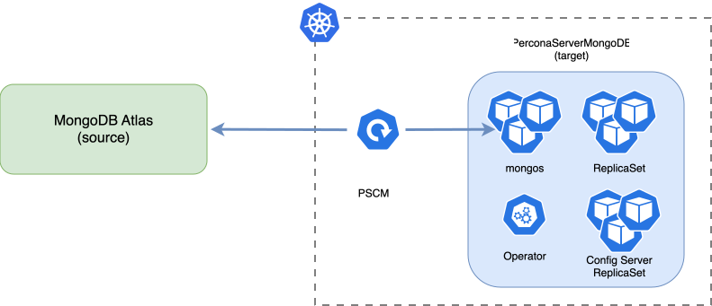

# Real-time replication and near-zero downtime migration with Percona ClusterSync for MongoDB (PCSM)

!!! note "Version added: [1.23.0](RN/Kubernetes-Operator-for-PSMONGODB-RN1.23.0.md)"

[Percona ClusterSync for MongoDB (PCSM) :octicons-link-external-16:](https://docs.percona.com/percona-clustersync-for-mongodb/) is a data migration and replication tool for MongoDB deployments. It clones existing data from source MongoDB deployment to target one and uses MongoDB change stream events to track the changes on the source and replicate them to the target in real time.

You can use Percona ClusterSync for MongoDB for:

* One-time migration with near-zero downtime
* A live replica of your data for testing or disaster recovery

You can replicate the full data set or exclude specific namespaces. In either case, PCSM creates the required indexes on the target.

For more information on PCSM, refer to [PCSM documentation :octicons-link-external-16:](https://docs.percona.com/percona-`PerconaServerMongoDBClusterSync`-for-mongodb/index.html#features).

## How it works with the Operator

The Operator deploys and manages PCSM through a dedicated **`PerconaServerMongoDBClusterSync`** Custom Resource (`psmdb-clustersync`). PCSM runs as a separate Deployment in the same namespace as the target cluster. The Operator uses PCSM API to control the replication flow.

You configure authentication for PCSM in the source cluster and
provide the user credentials within the Kubernetes Secret and
the cluster endpoint. Then define the source and target clusters
and the replication mode in the `PerconaServerMongoDBClusterSync` custom
resource. After you apply the configuration, the Operator does
the following:

* Deploys the PCSM Deployment
* Provisions a sync user on the target cluster
* Constructs MongoDB connection URIs to both source and target
clusters.
* Starts the replication: first it does the initial sync and
then replicates the changes from source to target in real time
* Monitors the replication mode changes and pauses, resumes or
finalizes the replication depending on your settings
* Surfaces replication state and lag on the
`PerconaServerMongoDBClusterSync` Custom Resource
* Coordinates backup and restore operations on the target
cluster so they do not interfere the active replication

You can monitor the replication progress. When the replication
lag is acceptable for cutover, finalize the replication. Then
reconfigure client applications to point to the target cluster.

For step-by-step instructions, see [Set up and use PCSM](clustersync-setup.md).

## Architecture

Components of this architecture are:

* **Source cluster** – The cluster you replicate data from. You can run it on premises (MongoDB Enterprise Advanced), in the cloud (MongoDB Atlas) or as another Kubernetes deployment. You manage the source cluster and must prepare it for replication: configure authentication, create a Kubernetes Secret with the PCSM user credentials and provide the cluster endpoint.

* **Target cluster** – The cluster you replicate data to. It is managed by the Operator. The Operator creates the sync user and constructs the connection string automatically based on the cluster topology.

* **PCSM Deployment** — Managed by the Operator. The Operator restarts and re-runs initial sync if it is interrupted during clone. After initial sync, it auto-resumes from a checkpoint on recoverable failures. For a hard failure during initial sync that needs a full reset, see [Troubleshooting](clustersync-setup.md#5-troubleshooting).

## Supported MongoDB deployments

Both source and target cluster can be replica sets or sharded clusters and must have the same major version. Minimum supported MongoDB versions are: 6.0.17, 7.0.13, 8.0.0.

Replication between sharded clusters is in the tech preview stage and is not recommended for production use yet. See [Sharding support](#sharding-support-in-pcsm-tech-preview) to learn more.

## Replication modes and states

You control the replication flow through the `PerconaServerMongoDBClusterSync` custom resource. Supported modes are:

* `running` – Start or resume replication. On start, PCSM runs initial sync, then replicates changes occurred on the source to the target. On resume, PCSM starts from the last saved checkpoint.
* `paused` – The replication is paused. PSCM saves the checkpoint in the change stream so that it can resume the replication without re-running the initial sync
* `finalized` – PCSM completes the replication, creates required indexes on the target and stops. This is one-time operation. Setting the replication mode to `running`, nothing has no effect to prevent accidental data resync. To start over, run [`pcsm reset` :octicons-link-external-16:](https://docs.percona.com/percona-clustersync-for-mongodb/pcsm-commands.html#reset) inside the PCSM Pod.

PCSM also reports a runtime **state**, which the Operator stores in `status.state`: `idle`, `running`, `paused`, `finalizing`, `finalized`, `failed`.

Find more information about modes, states, and conditions in [Custom resource statuses](cr-statuses.md#perconaservermongodbclustersync-status). For all configuration fields, see [ClusterSync Resource options](clustersync-options.md).

## Sharding support in PCSM (tech preview)

PCSM can replicate data between sharded clusters. Before the replication, it checks the source cluster for sharded collections and creates matching collections with the same shard keys on the target. The target cluster manages chunk distribution, primary shard names, and zones internally.

PCSM replicates **data only**, not sharding metadata. It connects through `mongos` on both sides, so source and target can have different numbers of shards.

## Backup and restore management

You can run backups and restores on the **source** as usual.

On the **target**, the Operator holds a lease while PCSM is active, so backups and restores wait. After you finalize replication and PCSM reports `finalized`, the Operator releases the lease and you can back up or restore the target again.

## Implementation specifics

* One active `PerconaServerMongoDBClusterSync` Custom Resource per target cluster (enforced by lease).
* Treat `source.uri` and source credentials as **immutable** after start. To change the source, delete and recreate the ClusterSync CR.
* `excludeNamespaces` applies only on `pcsm start`. Later changes do not re-filter an already running sync.
* The target sync user and finalized Deployment/Secrets remain until you delete the `PerconaServerMongoDBClusterSync` CR.

## Limitations

PCSM follows upstream [known issues and limitations :octicons-link-external-16:](https://docs.percona.com/percona-clustersync-for-mongodb/limitations.html). 

Notable constraints:

* Same **major** MongoDB version required on source and target.
* Single source / single target pair only.
* Reverse synchronization is not supported.
* Initial sync is **not resumable**. If PCSM failed during initial sync, it restarts it from scratch.
* PCSM connects to the **primary** only; `directConnection` to secondaries is ignored.
* Users, roles, and `system.*` collections are not synchronized.
* Unsupported types include timeseries, queryable encryption, Percona Memory Engine, and several sharding admin commands during replication.
* External authentication (LDAP, Kerberos, AWS IAM) is not supported for PCSM connections.

## Next steps

[Set up and use PCSM](clustersync-setup.md){.md-button}
