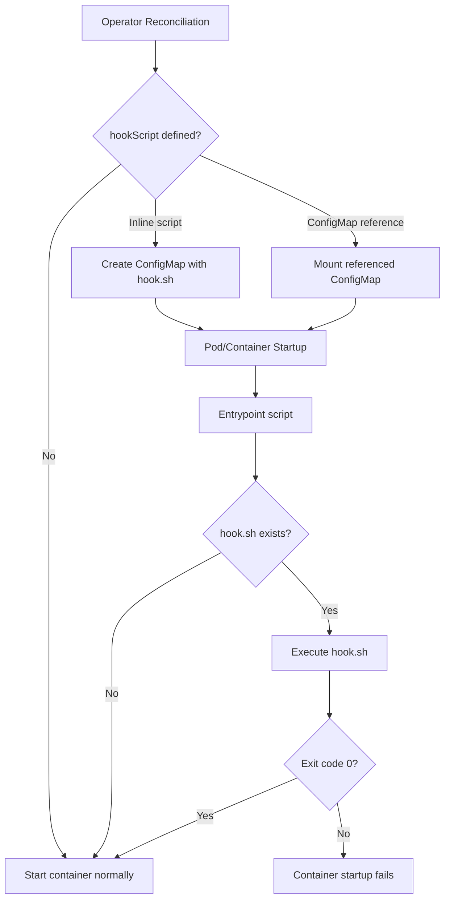

# Extend startup logic for Percona Server for MongoDB components

The Operator supports the `hookScript` feature that enables you to run custom shell scripts before MongoDB or PBM agent starts.

Using hook scripts, you can tailor startup behavior to your infrastructure and policies. For example, when you need to:

- Configure Fluent Bit logging for your MongoDB pods.
- Apply security hardening or compliance checks.
- Register nodes in a configuration management database (CMDB), monitoring, or audit systems.
- Modify configuration files dynamically before startup.
- Run specific pre‑backup logic for PBM agent.

Hook scripts run inside the container, immediately before the main process (`mongod`, `mongos`, or `pbm-agent`) starts.

## How `hookScript` works



1. You define a script either directly in the Custom Resource (CR) or reference a ConfigMap.
2. The Operator creates or mounts a ConfigMap containing `hook.sh`.
3. The container entrypoint (`ps-entry.sh` or `pbm-entry.sh`) checks for the script.
4. If found, it executes `hook.sh` before starting the main process.
5. If the script exits with a non‑zero code, the container startup fails.

## Where `hookScript` works

You can define hook scripts for:

- Regular replica set members (secondaries, primaries, and config servers).
- Hidden and non‑voting nodes.
- Arbiters.
- Mongos nodes.
- PBM backup agent.

## Configuration examples

For example, you want to capture the startup time of the container to observe when a `mongod` or `pbm-agent` container was last restarted to troubleshoot issues. The following steps show how to do it by defining the script in the Custom Resource directly and using a ConfigMap.

=== "Directly in the Custom Resource"

    1. Edit the `deploy/cr.yaml` Custom Resource manifest and define the hook script in the `hookScript` field.

        ```yaml
        spec:
          replicaSets:
            - name: rs0
              hookScript: 
                script: |
                  #!/usr/bin/env bash
                  echo "Startup time: $(date)" > /tmp/date
        ```

    2. Apply the configuration changes.

        ```bash
        kubectl apply -f deploy/cr.yaml -n <namespace>
        ```

    3. Check the startup time of the container.

        ```bash
        kubectl exec -it <container-name> -n <namespace> -- cat /tmp/date
        ```

=== "Using a ConfigMap"

    1. Create a ConfigMap configuration file with the hook script:

        ```yaml
        apiVersion: v1
        kind: ConfigMap
        metadata:
          name: hookscript-configmap
        data:
          hook.sh: |
            #!/usr/bin/env bash
            echo "Startup time: $(date)" > /tmp/date
        ```

    2. Create a ConfigMap object in the Kubernetes cluster.

        ```bash
        kubectl create -f hook-script.yaml -n <namespace>
        ```

    3. Reference the ConfigMap in the Custom Resource.

        ```yaml
        spec:
          replicaSets:
            - name: rs0
              hookScript:
                configMapRef:
                  name: hookscript-configmap
        ```

    4. Apply the configuration changes.

        ```bash
        kubectl apply -f deploy/cr.yaml -n <namespace>
        ```

    5. Check the startup time of the container.

        ```bash
        kubectl exec -it <container-name> -n <namespace> -- cat /tmp/date
        ```

## Best practices

- Keep scripts short and deterministic.
- Validate scripts in a test environment before production.
- Use exit 1 to intentionally block startup if a requirement is not met.
- Avoid long‑running operations; they delay Pod readiness.
- Store complex scripts in ConfigMaps for version control.
