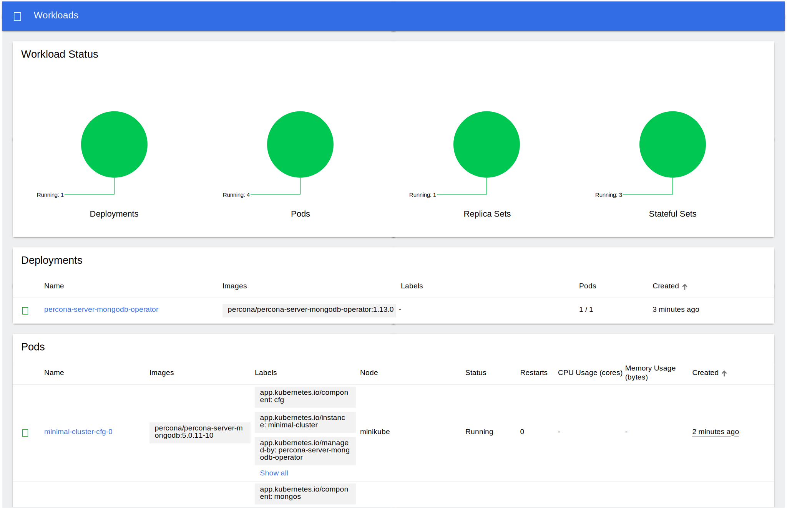

# Install Percona Server for MongoDB on Minikube



Installing the Percona Operator for MongoDB on [Minikube  :octicons-link-external-16:](https://github.com/kubernetes/minikube)
is the easiest way to try it locally without a cloud provider. Minikube runs
Kubernetes on GNU/Linux, Windows, or macOS system using a system-wide
hypervisor, such as VirtualBox, KVM/QEMU, VMware Fusion or Hyper-V. Using it is
a popular way to test Kubernetes application locally prior to deploying it on a
cloud.

The following steps are needed to run Percona Operator for MongoDB on minikube:

1. [Install minikube  :octicons-link-external-16:](https://kubernetes.io/docs/tasks/tools/install-minikube/), using a way recommended for your system. This includes the installation of the following three components:

    1. kubectl tool,

    2. a hypervisor, if it is not already installed,

    3. actual minikube package

    After the installation, run `minikube start --memory=5120 --cpus=4 --disk-size=30g`
    (parameters increase the virtual machine limits for the CPU cores, memory, and disk,
    to ensure stable work of the Operator). Being executed, this command will
    download needed virtualized images, then initialize and run the
    cluster. After Minikube is successfully started, you can optionally run the
    Kubernetes dashboard, which visually represents the state of your cluster.
    Executing `minikube dashboard` will start the dashboard and open it in your
    default web browser.

2. Deploy the operator [using  :octicons-link-external-16:](https://kubernetes.io/docs/reference/using-api/server-side-apply/) the following command:

    ``` {.bash data-prompt="$" }
    $ kubectl apply --server-side -f https://raw.githubusercontent.com/percona/percona-server-mongodb-operator/v{{ release }}/deploy/bundle.yaml
    ```

3. Deploy MongoDB cluster with:

    ``` {.bash data-prompt="$" }
    $ kubectl apply -f https://raw.githubusercontent.com/percona/percona-server-mongodb-operator/v{{ release }}/deploy/cr-minimal.yaml
    ```

    !!! note

        This deploys a one-shard MongoDB cluster with one replica set with one
        node, one mongos node and one config server node. The
        [deploy/cr-minimal.yaml  :octicons-link-external-16:](https://raw.githubusercontent.com/percona/percona-server-mongodb-operator/v{{ release }}/deploy/cr-minimal.yaml) is for minimal non-production deployment.
        For more configuration options please see
        [deploy/cr.yaml  :octicons-link-external-16:](https://raw.githubusercontent.com/percona/percona-server-mongodb-operator/v{{ release }}/deploy/cr.yaml) and [Custom Resource Options](operator.md). You can clone the
        repository with all manifests and source code by executing the following
        command:

        ``` {.bash data-prompt="$" }
        $ git clone -b v{{ release }} https://github.com/percona/percona-server-mongodb-operator
        ```

        After editing the needed options, apply your modified `deploy/cr.yaml` file as follows:

        ``` {.bash data-prompt="$" }
        $ kubectl apply -f deploy/cr.yaml
        ```

    The creation process may take some time.

    The process is over when both operator and replica set pod
    have reached their Running status. `kubectl get pods` output should look like this:

    --8<-- "./docs/assets/code/kubectl-get-minimal-response.txt"

    You can also track the progress via the Kubernetes dashboard:

    


## Verifying the cluster operation

It may take ten minutes to get the cluster started. When `kubectl get pods`
command finally shows you the cluster is ready, you can try to connect
to the cluster.



