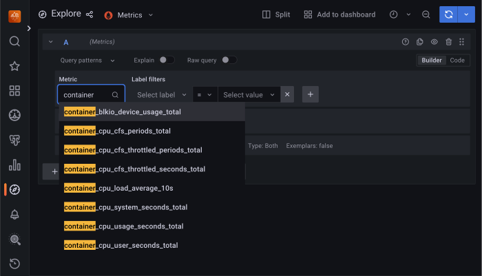
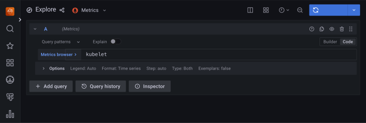

# Monitor Kubernetes 

Monitoring the state of the database is crucial to timely identify and react to performance issues. [Percona Monitoring and Management (PMM) solution enables you to do just that](monitoring.md).

However, the database state also depends on the state of the Kubernetes cluster itself. Hence it’s important to have metrics that can depict the state of the Kubernetes cluster.

This document describes how to set up monitoring of the Kubernetes cluster health. This setup has been tested with the [PMM server](https://docs.percona.com/percona-monitoring-and-management/details/architecture.html#pmm-server) as the centralized data storage and the Victoria Metrics Operator as the statistics collector, though the steps should also apply to other monitoring applications. 

## Considerations

1. In this setup we use [Victoria Metrics kubernetes monitoring stack](https://github.com/VictoriaMetrics/helm-charts/tree/master/charts/victoria-metrics-k8s-stack) Helm chart. When customizing the chart's values, consider the following:

    * Since we use the PMM server for monitoring, there is no need to store the data in Victoria Metrics Operator. Therefore, set the `vmsngle.enabled` and `vmcuster.enabled` parameters in the Victoria Metrics Helm chart to `false`.
    * The Prometheus node exporter is not installed by default since it requires privileged containers with the access to the host file system. If you need the metrics for Nodes, enable the Prometheus node exporter by setting the `prometheus-node-exporter.enabled` flag in the Victoria Metrics Helm chart to `true`.
    * [Check all the role-based access control rules provided by the charts](https://helm.sh/docs/topics/rbac/) and modify them based on your requirements. 

2. This setup is used for a 1:1 mapping from Kubernetes cluster to the PMM server. If you wish to monitor more than one Kubernetes cluster in a single PMM server, you need to configure the dashboard to filter a specific Kubernetes cluster. You also need to properly [relabel the metrics](https://docs.victoriametrics.com/vmagent.html#relabeling) from the backend.

## Pre-requisites

To set up monitoring of Kubernetes, you need the following:

1. PMM Server up and running. You can run PMM Server as a Docker image, a virtual appliance, or on an AWS instance. Please refer to the [official PMM documentation](https://docs.percona.com/percona-monitoring-and-management/setting-up/server/index.html) for the installation instructions.

2. [Helm v3](https://docs.helm.sh/using_helm/#installing-helm).

## Procedure

### Set up authentication in PMM Server

To access the PMM Server resources and perform actions on the server, configure authentication.

1. Get the PMM API key. The key must have the role "Admin".

    === "From PMM UI" 

        [Generate the PMM API key](https://docs.percona.com/percona-monitoring-and-management/details/api.html#api-keys-and-authentication){.md-button} 

    === "From command line"

        You can query your PMM Server installation for the API
        Key using `curl` and `jq` utilities. Replace `<login>:<password>@<server_host>` placeholders with your real PMM Server login, password, and hostname in the following command:

        ``` {.bash data-prompt="$" }
        $ API_KEY=$(curl --insecure -X POST -H "Content-Type: application/json" -d '{"name":"operator", "role": "Admin"}' "https://<login>:<password>@<server_host>/graph/api/auth/keys" | jq .key)
        ```

    !!! note

        The API key is not rotated. 

2. Encode the API key with base64.

    === "in Linux" 

        ````{.bash data-prompt="$" }
        $ echo -n <API-key> | base64 --wrap=0
        ````

    === "in macOS"   
        ```{.bash data-prompt="$" }
        $ echo -n <API-key> | base64 
        ```

3. Create the YAML file for the [Kubernetes Secrets](https://kubernetes.io/docs/concepts/configuration/secret/) and specify the API key value within. In this example the Secrets file is named `pmm-api-vmoperator.yaml`.

    ```yaml title="pmm-api-vmoperator.yaml"
    apiVersion: v1
    data:
      api_key: <base-64-encoded-API-key>
    kind: Secret
    metadata:
      name: pmm-token-vmoperator
      #namespace: default
    type: Opaque
    ```

4. Create the Namespace where you want to set up monitoring. The following command creates the Namespace `monitoring-system`. You can use another name.
    
    ```{.bash data-prompt="$" }
    $ kubectl create namespace monitoring-system
    ```

5. Create the Secrets object using the secrets file. Replace the `<filename>` placeholder with your value.

    ```{.bash data-prompt="$" }
    $ kubectl apply -f <filename> -n <namespace>
    ```

6. Check that the secret is created. The following command checks the secret for the resource named `pmm-token-vmoperator` (as defined in the `metadata.name` option in the secrets file). If you defined another resource name, specify your value.  

   ```{.bash data-prompt="$" }
   $ kubectl get secret pmm-token-vmoperator -n <namespace>
   ```

### Create a ConfigMap to mount for kube-state-metrics 

The `kube-state-metrics` (KSM) is a simple service that listens to the Kubernetes API server and generates metrics about the state of various objects - Pods, Deployments, Services and Custom Resources. 

To instruct the `kube-state-metrics` what metrics to capture, create the ConfigMap and mount it to a container. 

1. Edit the [example `configmap.yaml` configuration file](https://raw.githubusercontent.com/percona/percona-everest-cli/main/data/crds/victoriametrics/kube-state-metrics/configmap.yaml) and specify the `<namespace>`. The Namespace must match the Namespace where you created the Secret. 

2. Apply the configuration

    ```{.bash data-prompt="$" }
    $ kubectl apply -f <path-to-configmap.yaml>
    ```

    As a result, you have the `customresource-config-ksm` ConfigMap created. 

### Install the Victoria Metrics Operator Helm chart

1. Add the dependency repositories of [victoria-metrics-k8s-stack](https://github.com/VictoriaMetrics/helm-charts/blob/master/charts/victoria-metrics-k8s-stack) chart. 

    ```{.bash data-prompt="$" }
    $ helm repo add grafana https://grafana.github.io/helm-charts
    $ helm repo add prometheus-community https://prometheus-community.github.io/helm-charts
    ```

2. Update the repositories.

    ```{.bash data-prompt="$" }
    $ helm repo update
    ```

3. Add the Victoria Metrics Operator repository.

    ```{.bash data-prompt="$" }
    $ helm repo add vm https://victoriametrics.github.io/helm-charts/
    $ helm repo update
    ```

4. Export default values of `victoria-metrics-k8s-stack` chart to file `values.yaml` file.

    ```{.bash data-prompt="$" }
    $ helm show values vm/victoria-metrics-k8s-stack > values.yaml
    ```

5. Edit the `values.yaml` file and specify the following:

    * the IP address / hostname of the PMM server in the `externalVM.write.url` option
    * specify the unique name or an ID of the Kubernetes cluster in the ``vmagent.spec.externalLabels.cluster` option. Ensure to set different values if you are sending metrics from multiple Kubernetes clusters to the same PMM Server.
    * set the `vmsingle.enabled` and `vmcluster.enabled` to false
    * set the `alertmanager.enabled`, `vmalert.enabled` to false
    * set the `defaultDashboardsEnabled` to true
    * specify the configuration for scraping Custom resources related to the Operator

    ```yaml title="values.yaml"
    ...
    externalVM:
      read:
        url: ""
        # bearerTokenSecret:
        #   name: dbaas-read-access-token
        #   key: bearerToken
      write:
        url: "http://<PMM-server-IP>//victoriametrics/api/v1/write"
        bearerTokenSecret:
          name: pmm-token-vmoperator
          key: api_key
    ....
    ....
    vmsingle:
       enabled: false
    .....

    vmcluster:
      enabled: false
    ....

    alertmanager:
      enabled: false
    ....

    vmalert:
      enabled: false
    .....

    vmagent:
      spec:
        selectAllByDefault: true
        image:
          tag: v1.91.3
        scrapeInterval: 25s
        externalLabels:
          cluster: <cluster-name>
    ....

    defaultDashboardsEnabled: true

    .....

    kube-state-metrics:
      enabled: true
      ## all values for kube-state-metrics helm chart can be specified here  
      ## Customizaing kube-state-metrics installation for scraping Custom resources related to Percona Operators
      metricLabelsAllowlist:
      - pods=[app.kubernetes.io/component,app.kubernetes.io/instance,app.kubernetes.io/managed-by,app.kubernetes.io/name,app.kubernetes.io/part-of],persistentvolumeclaims=[app.kubernetes.io/component,app.kubernetes.io/instance,app.kubernetes.io/managed-by,app.kubernetes.io/name,app.kubernetes.io/part-of],jobs=[app.kubernetes.io/component,app.kubernetes.io/instance,app.kubernetes.io/managed-by,app.kubernetes.io/name,app.kubernetes.io/part-of]
      extraArgs: 
      - --custom-resource-state-config-file=/go/src/k8s.io/kube-state-metrics/config
      volumeMounts: 
      - mountPath: /go/src/k8s.io/kube-state-metrics/
        name: cr-config
      volumes: 
      - configMap:
          name: customresource-config-ksm
        name: cr-config  
      rbac: 
        extraRules:
        - apiGroups:
          - pxc.percona.com
          resources:
          - perconaxtradbclusters
          - perconaxtradbclusters/status
          - perconaxtradbclusterbackups
          - perconaxtradbclusterbackups/status
          - perconaxtradbclusterrestores
          - perconaxtradbclusterrestores/status
          verbs:
          - get
          - list
          - watch
        - apiGroups:
          - psmdb.percona.com
          resources:
          - perconaservermongodbs
          - perconaservermongodbs/status
          - perconaservermongodbbackups
          - perconaservermongodbbackups/status
          - perconaservermongodbrestores
          - perconaservermongodbrestores/status
          verbs:
          - get
          - list
          - watch
        - apiGroups:
          - pg.percona.com
          resources:
          - perconapgbackups/status
          - perconapgclusters/status
          - perconapgrestores/status
          - perconapgclusters
          - perconapgrestores
          - perconapgbackups
          - pgclusters
          - pgpolicies
          - pgreplicas
          - pgtasks
          verbs:
          - get
          - list
          - watch 

    .....

    coreDns:
      enabled: false
    ```

6. Install the Victoria Metrics Operator. The `vm-k8s` value in the following command is the Operator name. Replace the `<namespace>` placeholder with your value. The Namespace must be the same as the Namespace for the Secret and ConfigMap.

    ```{.bash data-prompt="$" }
    $ helm install vm-k8s vm/victoria-metrics-k8s-stack  -f values.yaml -n <namespace>
    ```

7. Validate the successful installation by checking the Pods. 

    ```{.bash data-prompt="$" }
    $ kubectl get pods -n <namespace>
    ```

    ??? example "Sample output" 

        ```{.text .no-copy}
        NAME                                                        READY   STATUS    RESTARTS   AGE
        vm-k8s-grafana-5f6bdb8c7c-d5bw5                             3/3     Running   0          90m
        vm-k8s-kube-state-metrics-57c5977d4f-6jtbj                  1/1     Running   0          81m
        vm-k8s-prometheus-node-exporter-kntfk                       1/1     Running   0          90m
        vm-k8s-prometheus-node-exporter-mjrvj                       1/1     Running   0          90m
        vm-k8s-prometheus-node-exporter-v98c8                       1/1     Running   0          90m
        vm-k8s-victoria-metrics-operator-6b7f4f786d-sctp8           1/1     Running   0          90m
        vmagent-vm-k8s-victoria-metrics-k8s-stack-fbc86c9db-rz8wk   2/2     Running   0          90m    
        ```
        
        What Pods are running depends on the configuration chosen in values used while installing `victoria-metrics-k8s-stack` chart.

## Verify metrics capture

1. Connect to the PMM server.
2. Click **Explore** and switch to the **Code** mode.
3. Check that the required metrics are captured, type the following in the Metrics browser dropdown:

    * [cadvisor](https://github.com/google/cadvisor/blob/master/docs/storage/prometheus.md):

       

    * kubelet:

       

    * [kube-state-metrics](https://github.com/kubernetes/kube-state-metrics/tree/main/docs) metrics that also include Custom resource metrics for the Operators deployed in your Kubernetes clusters:

      

