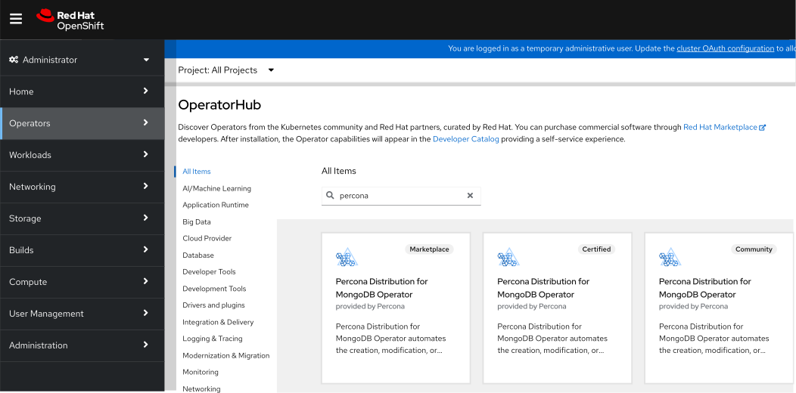
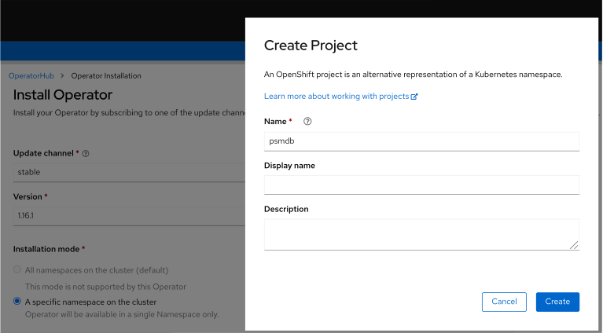
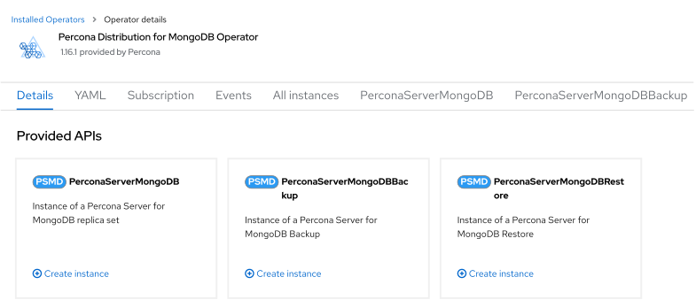

# Install Percona Server for MongoDB on OpenShift



Percona Operator for Percona Server for MongoDB is a [Red Hat Certified Operator  :octicons-link-external-16:](https://connect.redhat.com/en/partner-with-us/red-hat-openshift-certification). This means that Percona Operator is portable across hybrid clouds and fully supports the Red Hat OpenShift lifecycle.

Installing Percona Server for MongoDB on OpenShift includes two steps:

* Installing the Percona Operator for MongoDB,
* Install Percona Server for MongoDB using the Operator.

## Install the Operator

You can install Percona Operator for MongoDB on OpenShift using the web interface (the [Operator Lifecycle Manager :octicons-link-external-16:](https://docs.redhat.com/en/documentation/openshift_container_platform/4.2/html/operators/understanding-the-operator-lifecycle-manager-olm#olm-overview_olm-understanding-olm)), or using the command line interface.

### Install the Operator via the Operator Lifecycle Manager (OLM)

Operator Lifecycle Manager (OLM) is a part of the [Operator Framework :octicons-link-external-16:](https://github.com/operator-framework) that allows you to install, update, and manage the Operators lifecycle on the OpenShift platform.

Following steps will allow you to deploy the Operator and Percona Server for MongoDB on your OLM installation:

1. Login to the OLM and click the needed Operator on the OperatorHub page:

    

    Then click "Continue", and "Install".

2. A new page will allow you to choose the Operator version and the Namespace / OpenShift project you would like to install the Operator into. 

    
    
    Click "Install" button to actually install the Operator.

3. When the installation finishes, you can deploy your MongoDB cluster. In the "Operator Details" you will see Provided APIs (Custom Resources, available for installation). Click "Create instance" for the `PerconaServerMongoDB` Custom Resource. 

    
    
    You will be able to edit manifest to set needed Custom Resource options, and then click "Create" button to deploy your database cluster.

### Install the Operator via the command-line interface

1. Clone the percona-server-mongodb-operator repository:

    ``` {.bash data-prompt="$" }
    $ git clone -b v{{ release }} https://github.com/percona/percona-server-mongodb-operator
    $ cd percona-server-mongodb-operator
    ```

    !!! note

        It is crucial to specify the right branch with `-b`
        option while cloning the code on this step. Please be careful.

2. The Custom Resource Definition for Percona Server for MongoDB should be
    created from the `deploy/crd.yaml` file. The Custom Resource Definition
    extends the standard set of resources which Kubernetes “knows” about with the
    new items, in our case these items are the core of the operator.

    This step should be done only once; it does not need to be repeated with other deployments.

    [Apply it  :octicons-link-external-16:](https://kubernetes.io/docs/reference/using-api/server-side-apply/)
    as follows:

    ``` {.bash data-prompt="$" }
    $ oc apply --server-side -f deploy/crd.yaml
    ```

    !!! note

        Setting Custom Resource Definition requires your user to
        have cluster-admin role privileges.

    If you want to manage Percona Server for MongoDB cluster with a
    non-privileged user, the necessary permissions can be granted by applying the
    next clusterrole:

    ``` {.bash data-prompt="$" }
    $ oc create clusterrole psmdb-admin --verb="*" --resource=perconaservermongodbs.psmdb.percona.com,perconaservermongodbs.psmdb.percona.com/status,perconaservermongodbbackups.psmdb.percona.com,perconaservermongodbbackups.psmdb.percona.com/status,perconaservermongodbrestores.psmdb.percona.com,perconaservermongodbrestores.psmdb.percona.com/status
    $ oc adm policy add-cluster-role-to-user psmdb-admin <some-user>
    ```

    If you have a [cert-manager  :octicons-link-external-16:](https://docs.cert-manager.io/en/release-0.8/getting-started/install/openshift.html) installed, then you have to execute two more commands to be able to manage certificates with a non-privileged user:

    ``` {.bash data-prompt="$" }
    $ oc create clusterrole cert-admin --verb="*" --resource=iissuers.certmanager.k8s.io,certificates.certmanager.k8s.io
    $ oc adm policy add-cluster-role-to-user cert-admin <some-user>
    ```

3. Create a new `psmdb` project:

    ``` {.bash data-prompt="$" }
    $ oc new-project psmdb
    ```

4. Add role-based access control (RBAC) for Percona Server for MongoDB is
    configured with the `deploy/rbac.yaml` file. RBAC is
    based on clearly defined roles and corresponding allowed actions. These
    actions are allowed on specific Kubernetes resources. The details about users
    and roles can be found in [OpenShift documentation  :octicons-link-external-16:](https://docs.openshift.com/enterprise/3.0/architecture/additional_concepts/authorization.html).

    ``` {.bash data-prompt="$" }
    $ oc apply -f deploy/rbac.yaml
    ```

5. Start the Operator within OpenShift:

    ``` {.bash data-prompt="$" }
    $ oc apply -f deploy/operator.yaml
    ```

## Install Percona Server for MongoDB

1. Add the MongoDB Users secrets to OpenShift. These secrets
    should be placed as plain text in the stringData section of the
    `deploy/secrets.yaml` file as login name and
    passwords for the user accounts (see [Kubernetes
    documentation  :octicons-link-external-16:](https://kubernetes.io/docs/concepts/configuration/secret/)
    for details).

    After editing the yaml file, the secrets should be created
    with the following command:

    ``` {.bash data-prompt="$" }
    $ oc create -f deploy/secrets.yaml
    ```

    More details about secrets can be found in [Users](users.md).

2. Now certificates should be generated. By default, the Operator generates
    certificates automatically, and no actions are required at this step. Still,
    you can generate and apply your own certificates as secrets according
    to the [TLS instructions](TLS.md).

3. Percona Server for MongoDB cluster can be created at any time with the following steps:

    1. Uncomment the `deploy/cr.yaml` field `#platform:` and edit the field
        to `platform: openshift`. The result should be like this:

        ```yaml
        apiVersion: psmdb.percona.com/v1alpha1
        kind: PerconaServerMongoDB
        metadata:
          name: my-cluster-name
        spec:
          platform: openshift
        ...
        ```

    2. (optional) In you’re using minishift, please adjust antiaffinity policy to `none`

        ```yaml
           affinity:
             antiAffinityTopologyKey: "none"
        ...
        ```

    3. Create/apply the Custom Resource file:

        ``` {.bash data-prompt="$" }
        $ oc apply -f deploy/cr.yaml
        ```

        The creation process will take time. When the process is over your
        cluster will obtain the `ready` status. You can check it with the 
        following command:

        ``` {.bash data-prompt="$" }
        $ oc get psmdb
        ```

        ??? example "Expected output"

            ``` {.text .no-copy}
            NAME              ENDPOINT                                           STATUS   AGE
            my-cluster-name   my-cluster-name-mongos.default.svc.cluster.local   ready    5m26s
            ```

## Verifying the cluster operation

It may take ten minutes to get the cluster started. When `oc get psmdb`
command finally shows you the cluster status as `ready`, you can try to connect
to the cluster.


