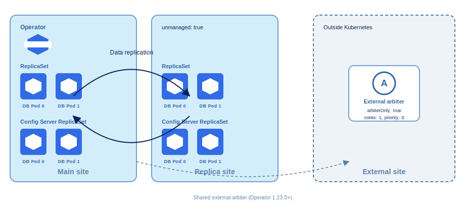

# Multi-cluster deployment with an external arbiter

In a multi-cluster replica set, MongoDB requires an **odd number of voting members** to elect a primary reliably. You can reach that total in two ways:

* **Topology A:** Deploy an odd number of voting members on the Main site and an even number on the Replica site (for example, three voting members locally and two remote voting members plus one non-voting remote member). See [Topology A — Non-voting third member](replication-plan-deployment.md#topology-a--without-external-arbiter).
* **Topology B (this guide):** Deploy an **even** number of data-bearing members on **both** the Main and Replica sites (for example, two on each). That gives four voting data members — still an even number. Add an **external arbiter** in a third location as the tie-breaker.

An **external arbiter** is a `mongod` process running **outside both Main and Secondary clusters** (for example, in another namespace, Kubernetes environment or on a VM in a third data center). When you interconnect sites, add the same arbiter host to `replsets.externalNodes` on **both** the Main and Replica Custom Resources. The arbiter stores no data and cannot become primary, but it participates in elections so the replica set keeps an odd number of voters.

The Operator registers the arbiter through the `externalNodes` configuration section in the Custom Resource. Do not enable `replsets.arbiter.enabled` on either Kubernetes cluster when using this topology.

This guide describes the multi-cluster setup with an external arbiter. The external arbiter site is deployed on Kubernetes.

This deployment topology is available with the Operator version 1.23.0 or later.

## When to use it and why

| Consider external arbiter when… | Reason |
|--------------------------------|--------|
| You can host a small `mongod` in a **third network location** | Satisfies MongoDB requirement for an odd number of voting members and the guidance to keep arbiters off the same hosts as primaries and secondaries |
| Each site still needs **local quorum** if the other site is down | With two local voters plus the arbiter, a single site can still reach a majority in many failure scenarios |
| Storage cost per site matters | Arbiters need minimal disk and CPU compared to full replica set members |


| Avoid or plan carefully when… | Reason |
|------------------------------|--------|
| You want maximum **local redundancy** at each site | Topology A (three data members per site) keeps a full local trio |
| You cannot operate a host outside Kubernetes | You are responsible for patching, monitoring, and TLS on the arbiter |
| You need **physical backups or PITR** that include every member | Arbiters hold no data; backup scope follows your PBM and topology design |


## Architecture

* **Main site** — authoritative cluster; the Operator manages replica set configuration, backups, and users. 
* **Replica site** — standby cluster in passive mode (`unmanaged: true`); replicates from Main. 
* **External arbiter site** - hosts only the arbiter node.

The table below summarizes the components and roles in this architecture:

| Location | Count | Role |
|----------|-------|------|
| Main site | 2 Pods | Data-bearing, voting (Operator-managed) |
| Replica (standby) site | 2 Pods | Data-bearing, voting (`unmanaged: true`) |
| External arbiter site | 1 Pod | Arbiter only (`arbiterOnly: true`, `votes: 1`, `priority: 0`) |



## Prerequisites

Complete the general multi-cluster requirements first:

1. [Plan your multi-cluster or multi-region deployment](replication-plan-deployment.md) — network mesh, matching credentials and TLS, Main vs Replica roles.
2. [Enable Multi-cluster Services](replication-mcs.md) so all sites resolve each other's Pod services.
3. Percona Operator for MongoDB **1.23.0+** on all clusters.

## Setup steps

### Deploy the Main site

Follow the [Deploy the Main site fore replication](replication-main.md) tutorial to deploy the Main size. However, set `replsets.size` to **2** (not 3) for each shard replica set.

For sharded clusters, you must deploy three config server members per site. This is because MongoDB requires a majority of config server nodes to reliably process writes to the cluster metadata. If you use a primary-secondary-arbiter configuration for config servers and one node becomes unavailable, achieving a majority for successful writes is impossible since arbiters do not store data nor participate in write operations for config servers. 

 and use the non-voting remote pattern when you interconnect config servers (see Interconnect sites).

### Deploy the Replica site

Follow the [Deploy the Replica site fore replication](replication-replica.md) tutorial for the deployment steps. 

Set `replsets.size` to **2** (not 3) for each shard replica set.

For sharded clusters, you must deploy three config server members per site. This is because MongoDB requires a majority of config server nodes to reliably process writes to the cluster metadata. If you use a primary-secondary-arbiter configuration for config servers and one node becomes unavailable, achieving a majority for successful writes is impossible since arbiters do not store data nor participate in write operations for config servers.

### Export the secrets and certificates from the Main site

Refer to the [Export the secrets and certificates from the Main site](replication-main.md#export-the-cluster-secrets-and-certificates-to-be-copied-from-main-to-replica). You will need them for the communication with the External arbiter site.

### Deploy the external arbiter site

This example shows how to deploy the external arbiter site on Kubernetes. 

1. Complete the [Initial preparation](replication-main.md#initial-preparation) steps for the External arbiter site. It must have the same namespace as the Main and Replica sites because it is a part of the shared DNS used to identify and resolve services across clusters.
  
    To align with the steps for Main and Replica site setup, create the namespace named `psmdb` for the external arbiter as well and set the context to it:

    ```bash
    kubectl create namespace psmdb
    kubectl config set-context --current --namespace=psmdb
    ```

2. Install the Operator Deployment:
    
    ```bash
    kubectl apply --server-side -f https://raw.githubusercontent.com/percona/percona-server-mongodb-operator/v{{release}}/deploy/bundle.yaml 
    ```

3. Create the Secrets [from the secrets files you prepared from the main cluster](replication-main.md#export-the-cluster-secrets-and-certificates-to-be-copied-from-main-to-replica).
4. Modify the Percona Server for MongoDB Custom Resource manifest to deploy only the arbiter node. It must include the following configuration:
    
    * Name your cluster to differentiate it from the main and replica ones. For example, `arbiter-cluster`.
    * Set the `spec.unmanaged` option to `true`.
    * Enable multi-cluster services in the spec.multiCluster subsection.
    * Set the `updateStrategy` key to `RollingUpdate`, because Smart Updates are not allowed on unmanaged clusters.
    * Set the `spec.unsafeFlags.replsetSize` and `spec.unsafeFlags.mongosSize` to true. This enables you to deploy Percona Server for MongoDB with a single instance.
    * Set the `spec.replsets.size` to `1`.
    * Set the `spec.replsets.arbiter.enabled` to `true`.
    * Reference the Secrets you created in the `spec.Secrets` section.
    
    Here's the example configuration:

    ```yaml
    apiVersion: psmdb.percona.com/v1
    kind: PerconaServerMongoDB
    metadata:
        name: arbiter-cluster
    spec:
        unmanaged: true
        multiCluster:
            enabled: true
            DNSSuffix: svc.clusterset.local
        updateStrategy: RollingUpdate
        upgradeOptions:
            apply: disabled
            schedule: "0 2 * * *"
        secrets:
            users: my-cluster-name-secrets
            encryptionKey: my-cluster-name-mongodb-encryption-key
            ssl: arbiter-cluster-ssl
            sslInternal: arbiter-cluster-ssl-internal
        replsets:
        - name: rs0
            size: 1
            expose:
                enabled: true
                type: ClusterIP
            volumeSpec:
                persistentVolumeClaim:
                    resources:
                        requests:
                            storage: 3Gi
          
          arbiter:
            enabled: true
            size: 1
          
        sharding:
            enabled: false
    ```

5. Apply the configuration:
    
    ```
    kubectl apply -f deploy/cr.yaml
    ```
            
   
??? admonition "Deploying the external arbiter outside Kubernetes"

    You can deploy the external arbiter site outside Kubernetes on a host that can reach **both** Kubernetes clusters over the network.

    1. Install `mongod` on a VM, bare-metal server, or other Kubernetes environment in a third location (for example `arbiter.dc3.example.com`).
    2. Use the **same user credentials and TLS certificates** as the Main and Replica sites.
    3. Ensure the arbiter hostname resolves from every cluster and appears on TLS certificates.
    4. Do **not** start a replica set manually on the arbiter site — the Operator adds it when you configure `externalNodes` on the Main site.


### Interconnect sites

Add remote members through `replsets.externalNodes` on **both** Main and Replica clusters. List exposed services first:

```bash
kubectl get services
```

#### On the Main site

Edit `deploy/cr-main.yaml`. Reference **two** Replica-site Pods and the **shared** external arbiter. 

For the sharded cluster, you add only two of the config server replica set nodes as voting members, while the third member is added as a non-voting one. In doing so you avoid split-brain situations and prevent the primary elections in the config server replica set if the Replica site is down or there is a network disruption between the sites:

```yaml
spec:
  replsets:
  - name: rs0
    size: 2
    expose:
      enabled: true
      type: ClusterIP
    externalNodes:
    - host: replica-cluster-rs0-0.psmdb.svc.clusterset.local
      votes: 1
      priority: 1
    - host: replica-cluster-rs0-1.psmdb.svc.clusterset.local
      votes: 1
      priority: 1
    - host: arbiter-cluster-rs0-0.psmdb.svc.clusterset.local
      port: 27017
      votes: 1
      priority: 0
      arbiterOnly: true
    sharding:
      enabled: true
      configsvrReplSet:
        size: 3
        externalNodes:
        - host: replica-cluster-cfg-0.psmdb.svc.clusterset.local
          votes: 1
          priority: 1
        - host: replica-cluster-cfg-1.psmdb.svc.clusterset.local
          votes: 1
          priority: 1
        - host: replica-cluster-cfg-2.psmdb.svc.clusterset.local
          votes: 0
          priority: 0
        expose:
          enabled: true
          type: ClusterIP
```

Update the Main site's configuration:

```bash
kubectl apply -f deploy/cr-main.yaml
```

#### On the Replica site

Edit `deploy/cr-replica.yaml`. Mirror the layout: two local members (via `size: 2`), two Main-site hosts, and the **same** arbiter hostname. 

For the sharded cluster, you add only two of the config server replica set nodes as voting members, while the third member is added as a non-voting one. In doing so you avoid split-brain situations and prevent the primary elections in the config server replica set if the Main site is down or there is a network disruption between the sites:

```yaml
spec:
  unmanaged: true
  replsets:
  - name: rs0
    size: 2
    externalNodes:
    - host: main-cluster-rs0-0.psmdb.svc.clusterset.local
      votes: 1
      priority: 1
    - host: main-cluster-rs0-1.psmdb.svc.clusterset.local
      votes: 1
      priority: 1
    - host: arbiter-cluster-rs0-0.psmdb.svc.clusterset.local
      port: 27017
      votes: 1
      priority: 0
      arbiterOnly: true
  sharding:
    enabled: true
    configsvrReplSet:
      size: 3
      externalNodes:
      - host: main-cluster-cfg-0.psmdb.svc.clusterset.local
        votes: 1
        priority: 1
      - host: main-cluster-cfg-1.psmdb.svc.clusterset.local
        votes: 1
        priority: 1
      - host: main-cluster-cfg-2.psmdb.svc.clusterset.local
        votes: 0
        priority: 0
      expose:
        enabled: true
        type: ClusterIP
```

Update the Replica site's configuration:

```bash
kubectl apply -f deploy/cr-replica.yaml
```

!!! warning

    Do not run `rs.addArb()` manually. The Operator overwrites manual replica set changes on reconciliation. Configure the arbiter only through `externalNodes`.

For field descriptions (`host`, `port`, `votes`, `priority`), see [Interconnect sites for replication](replication-interconnect.md).

### Verify connectivity

1. Connect to a Main site Pod:

    ```bash
    kubectl exec -it main-cluster-rs0-0 -- mongosh -u databaseAdmin -p <dbAdminPassword>
    ```

2. List members:

    ```
    rs.status().members
    ```

You should see **five** members: two from the Main site, two from the Replica site, and the external arbiter (`arbiterOnly` / `ARBITER` state). All should report `health: 1` when the network and TLS configuration are correct.

## Fail over to the Replica site

The external arbiter **never becomes primary**. Failover changes which **data-bearing** site is writable and which cluster the Operator manages.

### Planned switchover

Use the same managed/unmanaged swap as the default topology. See [Planned services switchover](replication-failover.md#planned-services-switchover):

1. Set the Main site to `unmanaged: true` and `updateStrategy: RollingUpdate`.
2. Set the Replica site to `unmanaged: false` and `updateStrategy: SmartUpdate`.
3. Apply both Custom Resources and confirm the primary moves to the Replica site.

### Disaster recovery (Main site unavailable)

When the Main site is unreachable, reconfigure the replica set from a **Replica site** Pod using `clusterAdmin` credentials.

**Always use indexes from your** `rs.config()` **output.**

1. Connect to the Replica site:

    ```bash
    kubectl exec -it replica-cluster-rs0-0 -- mongosh -u clusterAdmin -p <clusterAdminPassword>
    ```

2. Inspect members:

    ```
    rs.status().members
    ```

3. Store the configuration:

    ```
    cfg = rs.config()
    ```

4. Keep only surviving members — Replica data nodes and the arbiter. Example when Main members are down:

    ```
    cfg.members = [cfg.members[2], cfg.members[3], cfg.members[4]]
    ```

5. Force reconfiguration:

    ```
    rs.reconfig(cfg, {force: true})
    ```

6. Confirm the new primary is on the Replica site:

    ```
    rs.status().members
    ```

7. Repeat for **each shard** replica set and for the **config server** replica set (config servers use the non-voting topology, not the external arbiter).
8. Point application clients to the Replica site.

For more context, see [Fail over services to the Replica site](replication-failover.md).

## Limitations and reminders

* Do not combine this topology with `replsets.arbiter.enabled: true` on a Kubernetes site.
* `arbiterOnly` is supported in `replsets.externalNodes` only (not for config servers).
* Adjust member indexes during disaster failover; do not assume the examples match your deployment if member order differs.


