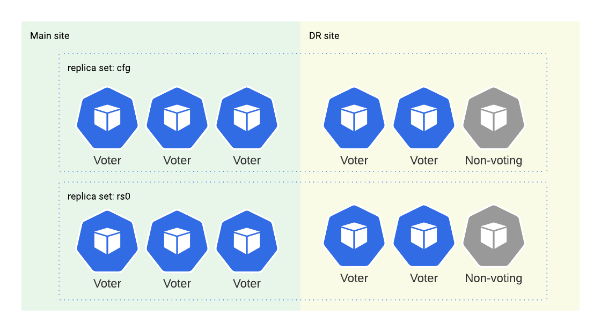

# Interconnect sites for replication

At this step, you should let the clusters know about each other and interconnect them for replication. To do so, you need to add the Replica site's nodes as external nodes for the Main site. In the same way, you add the Main's site nodes as external ones for the Replica site. 

Every site has three replica set members and three config server replica set members. But you add only two of them as voting members, while the third member is added as a non-voting one. In doing so, you avoid split-brain situations and prevent the primary elections if the Replica site is down or there is a network disruption between the sites.

In this way, the `main` cluster managed by the Operator is able to reach the 
the `replica` nodes.

## List the services

Ensure that the nodes are exposed by listing the services. Run the following command on both clusters:

```{.bash data-prompt="$" }
$ kubectl get services
```

??? example "Sample output"

    This is the sample output for the `main` cluster

    ```{.text .no-copy}
    gke-mcs-6i19n16iou    ClusterIP      34.118.226.213   <none>          27017/TCP         30m
    gke-mcs-7kc05t4an8    ClusterIP      34.118.232.25    <none>          27017/TCP         34m
    gke-mcs-8rnph5kn83    ClusterIP      34.118.232.15    <none>          27017/TCP         30m
    gke-mcs-c2rifb19i2    ClusterIP      34.118.227.18    <none>          27017/TCP         37m
    gke-mcs-d2a5n9jthp    ClusterIP      34.118.238.169   <none>          27017/TCP         39m
    gke-mcs-eu3ms5pd46    ClusterIP      34.118.233.180   <none>          27017/TCP         25m
    gke-mcs-fvvrfrc8lj    ClusterIP      34.118.229.203   <none>          27017/TCP         30m
    gke-mcs-gqv8a8hvj0    ClusterIP      34.118.239.68    <none>          27017/TCP         39m
    gke-mcs-i7esf6en63    ClusterIP      34.118.231.126   <none>          27017/TCP         27m
    gke-mcs-jrvipn8erd    ClusterIP      34.118.235.246   <none>          27017/TCP         34m
    gke-mcs-mefti0gh66    ClusterIP      34.118.236.218   <none>          27017/TCP         37m
    gke-mcs-q1jve1uq67    ClusterIP      34.118.225.234   <none>          27017/TCP         25m
    gke-mcs-rp77hijaj0    ClusterIP      34.118.229.123   <none>          27017/TCP         39m
    gke-mcs-tjbtnp3ica    ClusterIP      34.118.236.161   <none>          27017/TCP         27m
    main-cluster-cfg      ClusterIP      None             <none>          27017/TCP         44m
    main-cluster-cfg-0    ClusterIP   34.118.227.52    34.42.135.122   27017:31233/TCP   44m
    main-cluster-cfg-1    ClusterIP   34.118.233.187   34.135.82.96    27017:31941/TCP   43m
    main-cluster-cfg-2    ClusterIP   34.118.227.173   35.202.26.197   27017:30961/TCP   42m
    main-cluster-mongos   ClusterIP      34.118.233.114   <none>          27017/TCP         44m
    main-cluster-rs0      ClusterIP      None             <none>          27017/TCP         44m
    main-cluster-rs0-0    ClusterIP      34.118.231.58    <none>          27017/TCP         44m
    main-cluster-rs0-1    ClusterIP      34.118.239.165   <none>          27017/TCP         43m
    main-cluster-rs0-2    ClusterIP      34.118.225.3     <none>          27017/TCP         42m
    ```

## Add the Replica site nodes to the Main site 

1. Modify the `deploy/cr-main.yaml` file of the Main site and define the exposed nodes of the Replica site in the 
`replsets.externalNodes` and `sharding.configsvrReplset.externalNodes`
subsections. For each node, specify the following:

    - set `host` to the URL of the external replset instance. When exposed, a node has its own service, recognized by the domain name `<service-name>.<namespace>.svc.clusterset.local`
    - set `port` to the port number of the external node. If not set, the default `27017`
       port is used,
    - set `priority` to define the [priority  :octicons-link-external-16:](https://docs.mongodb.com/manual/reference/replica-configuration/#mongodb-rsconf-rsconf.members-n-.priority)
        of the external node. The default priority for local members of the cluster is `2`. When you add external nodes, set the lower priority to avoid an unmanaged node being elected
        as a primary. A zero `0` priority adds the node as a [non-voting member](arbiter.md#adding-non-voting-nodes).
    - set `votes` to the number of [votes  :octicons-link-external-16:](https://docs.mongodb.com/manual/reference/replica-configuration/#mongodb-rsconf-rsconf.members-n-.votes)
        an external node can cast in a replica set election (`0` is default and
        should be used for non-voting members of the cluster).

    Here is an example:

    ```yaml
    apiVersion: psmdb.percona.com/v1
    kind: PerconaServerMongoDB
    metadata:
      name: main-cluster
    spec:
    ...
      updateStrategy: SmartUpdate
      multiCluster:
        enabled: true
        DNSSuffix: svc.clusterset.local
      upgradeOptions:
        apply: disabled
        schedule: "0 2 * * *"
      secrets:
        users: my-cluster-name-secrets
        encryptionKey: my-cluster-name-mongodb-encryption-key
      replsets:
      - name: rs0
        size: 3
        externalNodes:
        - host: replica-cluster-rs0-0.psmdb.svc.clusterset.local
          votes: 1
          priority: 1
        - host: replica-cluster-rs0-1.psmdb.svc.clusterset.local
          votes: 1
          priority: 1
        - host: replica-cluster-rs0-2.psmdb.svc.clusterset.local
          votes: 0
          priority: 0
          expose:
          enabled: true
          type: ClusterIP   

      sharding:
        enabled: true
        configsvrReplSet:
          size: 3
          externalNodes:
          - host: replica-cluster-cfg0-1.psmdb.svc.clusterset.local
            votes: 1
            priority: 1
          - host: replica-cluster-cfg0-1.psmdb.svc.clusterset.local
            votes: 1
            priority: 1
          - host: replica-cluster-cfg0-1.psmdb.svc.clusterset.local
            votes: 0
            priority: 0
          expose:
            enabled: true
            type: ClusterIP

        mongos:
          size: 3
          expose:
            type: ClusterIP

    ```

2. Apply the changes:

    ```{.bash data-prompt="$" }
    $ kubectl apply -f deploy/cr-main.yaml
    ```

## Add Main site nodes to the Replica site

1. Modify the `deploy/cr-main.yaml` file of the Replica site and define the exposed nodes of the Main site in the
`replsets.externalNodes` and `sharding.configsvrReplset.externalNodes`
subsections. For each node, specify the following:
    
    ```yaml
    apiVersion: psmdb.percona.com/v1
    kind: PerconaServerMongoDB
    metadata:
      name: replica-cluster
    spec:
    ... 
      replsets:
      - name: rs0
        size: 3
        externalNodes:
        - host: main-cluster-rs0-0.psmdb.svc.clusterset.local
            votes: 1
            priority: 1
        - host: main-cluster-rs0-1.psmdb.svc.clusterset.local
            votes: 1
            priority: 1
        - host: main-cluster-rs0-2.psmdb.svc.clusterset.local
            votes: 0
            priority: 0

      sharding:
        configsvrReplSet:
            externalNodes:
            - host: main-cluster-cfg-0.psmdb.svc.clusterset.local
              votes: 1
              priority: 1
            - host: main-cluster-cfg-1.psmdb.svc.clusterset.local
              votes: 1
              priority: 1
            - host: main-cluster-cfg-2.psmdb.svc.clusterset.local
              votes: 0
              priority: 0
    ```

2. Apply the configuration:

    ```{.bash data-prompt="$" }
    $ kubectl apply -f deploy/cr-replica.yaml
    ```

## Check cluster connectivity

Verify that the clusters are interconnected by connecting to one of them. 

1. Connect to one of the Pods directly using the credentials of the database admin user. Refer to the [Connect to Percona Server for MongoDB](connect.md) tutorial how to retrieve user credentials:

    ```{.bash data-prompt="$" }
    $ kubectl exec -it main-cluster-rs0-0 -- mongosh -u databaseAdmin -p <dbAdminPassword>
    ```

2. List replica set members:

    ```
    rs.status().members
    ```

    ??? example "Sample output"

        ```{.text .no-copy}
        {
            _id: 0,
            name: 'main-cluster-rs0-0.psmdb.svc.clusterset.local:27017',
            health: 1,
            state: 1,
            stateStr: 'PRIMARY',
            .....
        },
        {
            _id: 1,
            name: 'main-cluster-rs0-1.psmdb.svc.clusterset.local:27017',
            health: 1,
            state: 2,
            stateStr: 'SECONDARY',
            .....
        },
        {
            _id: 2,
            name: 'main-cluster-rs0-2.psmdb.svc.clusterset.local:27017',
            health: 1,
            state: 2,
            stateStr: 'SECONDARY',
            .....
        },
        {
            _id: 3,
            name: 'replica-cluster-rs0-0.psmdb.svc.clusterset.local:27017',
            health: 1,
            state: 2,
            stateStr: 'SECONDARY',
            ......
        },
        {
            _id: 4,
            name: 'replica-cluster-rs0-1.psmdb.svc.clusterset.local:27017',
            health: 1,
            state: 2,
            stateStr: 'SECONDARY',
            ....
        },
        {
            _id: 5,
            name: 'replica-cluster-rs0-2.psmdb.svc.clusterset.local:27017',
            health: 1,
            state: 2,
            stateStr: 'SECONDARY',
            ....
        }
        ```

The members from both clusters appear in the list and the configuration looks like this:



## Switch over services to the Replica site 

You can switch over services to the Replica site while doing some planned maintenance on the Main site. Here's how to do it:

1. Set the Main site to the unmanaged mode and change the Update strategy to RollingUpdate. Modify the `deploy/cr-main.yaml` file:

    ```yaml
    spec:
      unamanaged: true
      updateStrategy: RollingUpdate
    ```

2. Apply the configuration:

    ```{.bash data-prompt="$" }
    $ kubectl apply -f deploy/cr-main.yaml
    ```

3. Put the Replica site in the managed mode:

     ```yaml
    spec:
      unamanaged: false
      updateStrategy: SmartUpdate
    ```
    
4. Apply the configuration:

    ```{.bash data-prompt="$" }
    $ kubectl apply -f deploy/cr-replica.yaml
    ```
  
5. Connect to one of the Replica site Pods and check the replica set status. You should see that it has re-elected the new primary.