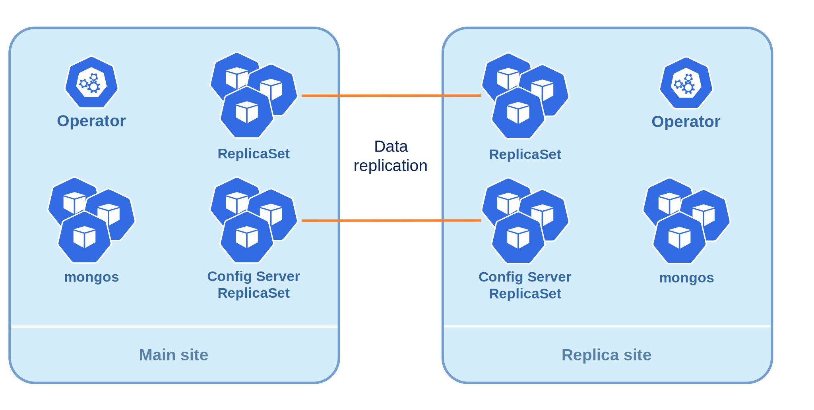

# About multi-cluster and multi-region Percona Operator for MongoDB deployments

MongoDB is built for distributed resilience — and Percona Operator for MongoDB unlocks that power across clusters and regions. 

This section introduces two powerful deployment models — **multi-cluster** and **multi-region**. It also explains how to configure cross-site replication using the Operator. You'll learn how to structure your clusters, understand the roles of Main and Replica sites, and set up secure, synchronized Percona Server for MongoDB clusters across environments with the Operator.

## Deployment models: Multi-cluster vs Multi-region

At a glance, both models involve running Percona Server for MongoDB nodes across multiple environments. But their goals, scope, and setup differ.

*  **Multi-cluster** deployments span multiple Kubernetes clusters, typically within the same cloud provider or region. This model is ideal for high availability, staging/production isolation, or cluster migration.
*  **Multi-region** deployments extend MongoDB across geographically distributed data centers or cloud regions. This setup supports disaster recovery, latency optimization, and jurisdictional data control.

While the underlying mechanics such as replica sets, TLS, and service exposure are similar, multi-region deployments introduce additional complexity around DNS, network reachability, and manual configuration.

### Cross-site replication

To maintain the same set of data in clusters within multi-cluster or multi-region deployment, the Operator uses the cross-site replication. This means that one cluster is the Main site and another one(s) - the Replica site(s).

The following diagram shows how the data is replicated between the sites.

* **Main site**: This is the authoritative cluster. It runs the primary node which accepts the write traffic. The Operator fully controls this site, managing the replica set configuration, backups, user credentials and other operations.
* **Replica site**: These are secondary clusters that host MongoDB nodes and replicate data from the Main site. The Operator deploys this site in passive mode and doesn't control the replica set configuration there. The passive mode is set by the `unmanaged: true` flag in the Custom Resource.

This separation ensures consistency and avoids conflicts when managing distributed deployments.

### Voting topologies for cross-site replication

When you interconnect Main and Replica sites, you must keep an **odd number of voting members** in each replica set. 

You can achieve it with the following approaches:

1. **Make one data-bearing member on the Replica site non-voting** — Reduce the number of voting members on the Replica site to an even number when you connect both Main and Replica sites. This setup ensures that the combined total voting members across both sites is always **odd**, enabling proper primary elections.
2. **Use an external arbiter node** to break election ties. In this setup, you deploy Main and Replica sites and run a separate arbiter node in a third location. Then, add an even number of data-bearing nodes as voting members and this arbiter as a voting member when you interconnect sites. So when an election occurs, the arbiter helps elect the primary. This keeps the total number of votes odd, preventing split-brain situations.

The Deployment section in this guide focuses on the first approach. For the setup steps of using the external arbiter, see [Multi-cluster setup with an external arbiter](replication-external-arbiter.md).

See [Choose a voting topology](replication-plan-deployment.md#choose-a-voting-topology) to compare models.

## Why to use multi-cluster or multi-region?

Choosing the right topology depends on your goals. Here are common use cases that you can achieve with these models:

* High availability - Spread MongoDB nodes across clusters to avoid single points of failure. If one cluster goes down, others remain operational.
*  Staging vs Production Isolation - Run isolated environments with shared data topology. Test changes safely without impacting production.
*  Cluster migration - Move workloads between clusters or cloud providers with minimal downtime.
*  Disaster recovery - Replicate data across regions to survive outages. Even if an entire data center fails, your application stays online.
*  Geo-distributed applications - Serve users from the nearest region to reduce latency and improve experience.
*  Compliance isolation - Keep data within specific jurisdictions to meet regulatory requirements.

## Next steps

[Plan your deployment](replication-plan-deployment.md){.md-button}
