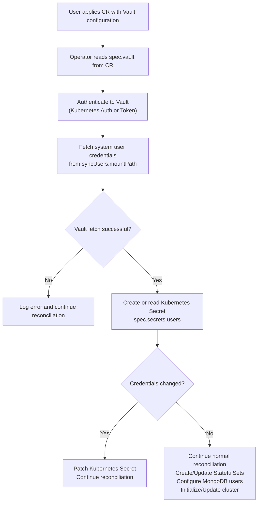

# Manage system users with Vault

You can integrate the Percona Server for MongoDB Operator with HashiCorp Vault to fetch and manage system user credentials.

This allows you to centralize password management, enforce rotation policies, and maintain a single source of truth for sensitive credentials.

## How it works

When [Vault is enabled](#configuration-steps), the Operator:

* Retrieves system user passwords from Vault during cluster creation
* Creates Kubernetes Secrets using those passwords
* Sends periodic requests to Vault for updates
* Compares Vault credentials with the Secret during each reconciliation loop and patches the Secret when values differ.
* Applies its standard password rotation routine to update credentials inside the cluster
* Ensures Vault remains the authoritative source
* Continues reconciling even if Vault is temporarily unavailable

If the Operator fails to retrieve credentials from Vault and a user Secret exists in the cluster, it logs an error and continues reconciling so the cluster stays available. If no user Secret exists, the Operator blocks the cluster reconciliation.

The following diagram outlines the workflow:

### Default path for user credentials

By default, the user credentials are stored  at the path `secret/data/psmdb/{role}/{namespace}/{name}/users`, where:

* `{role}` is the role for the Operator that you create in Vault
* `{namespace}` is the namespace where Percona Server for MongoDB is deployed
* `{name}` is the Percona Server for MongoDB cluster name as defined in the Custom Resource

You can override this path using the `vault.syncUsers.mountPath` and `vault.syncUsers.keyPath` options in the Custom Resource.

### Authentication options for Vault

The Operator can authenticate in Vault in two ways:

* **Using Kubernetes service accounts** - The Operator authenticates to Vault using its Service Account JWT. This method is recommended when Vault runs in the same Kubernetes cluster
* **Using Vault tokens** - The Operator authenticates to Vault using a pre-created Vault token. This method is used when Vault is deployed outside Kubernetes or in another cluster.

## Configuration

See [Configure Vault for system user management](system-users-vault-setup.md)