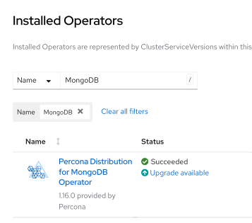

# Upgrade the Operator and CRD on OpenShift via Operator Lifecycle Manager (OLM)

If you have [installed the Operator on the OpenShift platform using OLM](openshift.md#install-the-operator-via-the-operator-lifecycle-manager-olm), you can upgrade the Operator within it.

If you know the OLM upgrade workflow, jump to the [update Deployment steps](#upgrade-the-operator-via-olm).

### Understand how OLM applies Operator upgrades

OLM manages the Operator using a resource called a `ClusterServiceVersion` (CSV).
Each CSV represents a specific version of the Operator and contains:

* the Operator Deployment specification
* required RBAC permissions
* CRD definitions
* metadata and examples

When a new Operator version is available and the upgrade is approved, OLM installs the new CSV and reconciles the Operator Deployment to match it.
The following items are replaced with the values defined in the new CSV:

* container image
* command and arguments
* labels and annotations
* probes
* most Deployment fields

If you previously customized the Operator Deployment manually, these changes are overwritten during the upgrade.

The CRD may be updated too, if the new Operator version introduces schema changes.
However, OLM doesn't modify the `PerconaServerMongoDB` Custom Resource. It remains unchanged and continues running with its current configuration. For how to update it, refer to [Update Percona Server for MongoDB](update_openshift.md).

#### Persisting custom Operator configuration

If you need to customize the Operator Deployment (for example, to adjust resource limits or set environment variables), you can do it through the Subscription.

A Subscription is the OLM resource that defines which operator you want to install and how you want it to be upgraded. A Subscription connects your cluster to an Operator package in a CatalogSource and ensures that OLM continuously manages that Operator according to your chosen update strategy.

Here's how you can customize the Operator Deployment. This example command sets an environment variable for the Operator:

```bash
kubectl patch subscription percona-server-mongodb-operator -n <namespace> \
  --type merge \
  -p '{"spec":{"config":{"env":[{"name":"LOG_LEVEL","value":"DEBUG"}]}}}'
```

OLM supports overriding only the following fields through the Subscription:

* env
* envFrom
* volumes
* volumeMounts
* resources
* nodeSelector
* tolerations
* affinity

These overrides are applied on top of the CSV and persist across upgrades. All other fields are overridden by the values from the new CSV during the Operator Deployment upgrade.

## Upgrade the Operator via OLM

1. Find the initial Operator installation image with `kubectl get deploy` command:

    ```bash
    kubectl get deploy percona-server-mongodb-operator -o yaml
    ```
    
    ??? example "Expected output"

        ``` {.text .no-copy}
        ...
        "containerImage": "registry.connect.redhat.com/percona/percona-server-mongodb-operator@sha256:201092cf97c9ceaaaf3b60dd1b24c7c5228d35aab2674345893f4cd4d9bb0e2e",
        ...
        ```

2. [Apply a patch :octicons-link-external-16:](https://kubernetes.io/docs/tasks/run-application/update-api-object-kubectl-patch/) to update the `initImage` option of your cluster Custom Resource with this value taken from `containerImage`. Supposing that your cluster name is `my-cluster-name`, the command should look as follows:

    ```bash
    kubectl patch psmdb my-cluster-name --type=merge --patch '{
        "spec": {
            "initImage":"registry.connect.redhat.com/percona/percona-server-mongodb-operator@sha256:201092cf97c9ceaaaf3b60dd1b24c7c5228d35aab2674345893f4cd4d9bb0e2e"
            }}'
    ```

3. Login to your OLM installation and list installed Operators for your Namespace to see if there are upgradable items:

    


4. Click the "Upgrade available" link to see upgrade details, then click "Preview InstallPlan" button, and finally "Approve" to upgrade the Operator.

## Next steps

[Upgrade the database](update_openshift.md){.md-button}