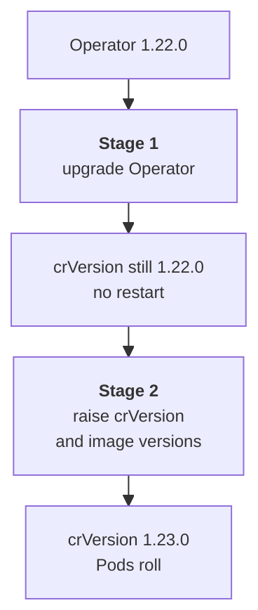

# Update Percona Operator for MongoDB

Use this page to understand how upgrades work, check compatibility before you start, and pick the right procedure.

An upgrade has two independent stages:

* Upgrade the Operator and Custom Resource Definition (CRD)
* Upgrade the database (Percona Server for MongoDB)

You can run both stages, or only the database stage, depending on what you need to change. See [Choose your upgrade path](#choose-your-upgrade-path) for use cases.

## How an upgrade works

An upgrade has **two independent stages**, and you decide when to run each one. Stage 2 does not have to follow stage 1 immediately.

<div markdown="1" style="text-align: center">


```mermaid
%%{init: {"flowchart": {"nodeSpacing": 14, "rankSpacing": 22, "useMaxWidth": false}, "themeVariables": {"fontSize": "12px"}} }%%
flowchart TB
  A["Operator 1.22.0"]
  B["<b>Stage 1</b> <br> upgrade Operator"]
  C["crVersion still 1.22.0 <br> no restart"]
  D["<b>Stage 2</b> <br> raise crVersion <br> and image versions"]
  E["crVersion 1.23.0 <br> Pods roll"]
  A --> B --> C --> D --> E
```

</div>

You can pause between stage 1 and stage 2. For example, upgrade the Operator across a fleet first, then move database clusters on your own schedule.

### Stage 1: upgrade the Operator

You install the new version of the CRD and the Operator Deployment. The Operator runs in its own Pod and is not in the data path, so updating it does not interrupt client connections.

Your database Pods are not restarted at this stage, because the cluster Custom Resource still declares the old `crVersion` and the old images. The new Operator recognizes that version and keeps managing the cluster with the behavior it already had.

### Stage 2: upgrade the database

When you are ready, raise `crVersion` and the image versions in the Custom Resource. You can do this during a maintenance window, in a quieter period, or for one cluster at a time.

That change rolls the database Pods. With the default [Smart Update](#update-strategies) strategy, the Operator restarts Pods one at a time and updates the primary last, so the cluster stays available throughout the upgrade.

### Why the stages can be separated

The CRD supports the last three minor Operator versions: the current one and the two before it. For example, with Operator 1.23.0 installed, clusters that still declare `crVersion: 1.22.0` or `crVersion: 1.21.0` keep running normally. A cluster does not have to move the moment you upgrade the Operator.

That window is also the limit. Once your Operator is more than two minor versions ahead of a cluster's `crVersion`, the cluster has to catch up. Plan stage 2 before the gap gets that wide. See [Considerations](update-operator.md#considerations).

!!! note

    The procedures on the individual upgrade pages patch `crVersion` and the images in one command, which runs both stages back to back. Use that path when you intend to do both at once. To keep the stages apart, upgrade the CRD and Operator first, then patch `crVersion` and the images later.

## Before you upgrade: limits you should know

* **Take a backup first.** Do this before any upgrade. See [Backup and restore](backups.md) or [On-demand backup](backup-tutorial.md).
* **Test in staging first.** Do this for any upgrade, especially Operator upgrades and major database version upgrades, before you run it against production. Operator upgrades can cause performance degradation.
* **Version jumps happen one step at a time.** You can upgrade the Operator only to the nearest `major.minor` version. Bigger gaps need several sequential upgrades. Database major versions also move one version at a time. See [Considerations](update-operator.md#for-the-operator-upgrades) and [Major version upgrades](update-major.md).
* **Stay within the CRD compatibility window.** The CRD supports the last three minor Operator versions. Plan stage 2 before your Operator moves more than two minor versions ahead of a cluster's `crVersion`. See [Why the stages can be separated](#why-the-stages-can-be-separated) and [Considerations](update-operator.md#considerations).
* **FCV changes are not easily reversible.** Setting [`upgradeOptions.setFCV`](operator.md#upgradeoptionssetfcv) is not undone by downgrading the image afterward. See [Feature Compatibility Version](update-major.md#feature-compatibility-version).
* **MongoDB end-of-life notices.** MongoDB 4.4 reached end of life in Operator 1.16.0, and MongoDB 5.0 in Operator 1.19.0. Upgrade the database to a supported major version before you upgrade the Operator past those releases. See [End of Life versions of MongoDB](update-minor-automatic.md#end-of-life-versions-of-mongodb).
* **Known problematic version combination.** Operator 1.19.0 or 1.19.1 with a sharded cluster and MongoDB 8.0 can fail point-in-time recovery. See [Considerations](update-operator.md#considerations).

## Choose your upgrade path

### Upgrade the Operator and CRD

Upgrade the Operator and CRD when:

* New database features need changes in this Operator version
* You want automation or fixes from the new Operator
* Compatibility between the Operator and the database requires a synchronized update

| You installed the Operator via | Use |
| --- | --- |
| `kubectl` | [Upgrade manually](update-crd-manual.md) |
| Helm | [Upgrade via Helm](update-crd-helm.md) |
| OLM on OpenShift | [Upgrade via OLM](update-crd-olm.md) |

### Upgrade the database

Upgrade the database after you have already upgraded the Operator and now want to move the database forward, or when the new database version has features or fixes unrelated to the Operator.

Check the [version compatibility matrix](versions.md) first to confirm that your current Operator version supports the new database version.

| You want to | Use |
| --- | --- |
| Let the Operator upgrade the database automatically | [Automatic minor upgrades](update-minor-automatic.md) |
| Pin the database to a specific version | [Upgrade to a specific version](update-minor-set-version.md) |
| Control each Pod restart yourself (Rolling Update or On Delete) | [Upgrade manually](update-manually.md) |
| Move to the next major MongoDB version | [Major upgrades](update-major.md) |

On OpenShift, database upgrades follow a different procedure. See [Upgrade Percona Server for MongoDB on OpenShift](update-openshift.md).

## Update strategies

Choose how the Operator or Kubernetes updates your database cluster during an upgrade by setting `updateStrategy` in the [Custom Resource](operator.md):

* `SmartUpdate`
* `RollingUpdate`
* `OnDelete`

### Smart Update

Smart Update is the default and recommended strategy. The Operator controls the update order and restarts Pods so that the primary is updated last. That reduces connection disruption until the whole cluster is on the new settings.

Smart Update also applies when you change a ConfigMap, rotate passwords, or change resource values, not only during database version upgrades.

### Rolling Update

Rolling Update is [controlled by Kubernetes :octicons-link-external-16:](https://kubernetes.io/docs/concepts/workloads/controllers/statefulset/#update-strategies). The StatefulSet controller deletes a Pod, updates it, waits until it reports Ready, then moves to the next Pod. The update order matches Pod termination order, which may not be optimal for Percona Server for MongoDB.

### On Delete

With On Delete, you manually delete each Pod so the StatefulSet controller recreates it with the updated configuration. See the [Kubernetes StatefulSet update strategies :octicons-link-external-16:](https://kubernetes.io/docs/concepts/workloads/controllers/statefulset/#update-strategies).

For upgrades that use `RollingUpdate` or `OnDelete`, see [Upgrade manually](update-manually.md).

### Revision history limit

Each time the Operator updates a StatefulSet Pod template, Kubernetes stores a revision in the StatefulSet history. Set [`spec.revisionHistoryLimit`](operator.md#revisionhistorylimit) to control how many revisions are kept. Use a lower value to reduce stale revisions in the namespace, or a higher value to keep more rollback points after frequent configuration changes.

```yaml
spec:
  updateStrategy: SmartUpdate
  revisionHistoryLimit: 10
```

When you omit this option, Kubernetes keeps the default of 10 revisions.

## See also

* [Upgrade the Operator and CRD](update-operator.md)
* [Upgrade Percona Server for MongoDB](update-db.md)
* [Known limitations](limitations.md)
