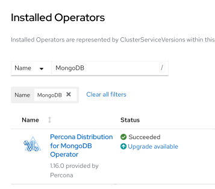

# Update Database and Operator

Starting from the version 1.1.0 the Percona Operator for MongoDB allows upgrades
to newer versions. The upgradable components of the cluster are
the following ones:

* the Operator;
* [Custom Resource Definition (CRD)](operator.md),
* Database Management System (Percona Server for MongoDB).

The list of recommended upgrade scenarios includes two variants:

* Upgrade to the new versions of the Operator *and* Percona Server for MongoDB,
* Minor Percona Server for MongoDB version upgrade *without* the Operator upgrade.

## Upgrading the Operator and CRD

!!! note

    The Operator supports **last 3 versions of the CRD**, so it is technically
    possible to skip upgrading the CRD and just upgrade the Operator. If the CRD
    is older than the new Operator version *by no more than three releases*, you
    will be able to continue using the old CRD and even carry on Percona Server
    for MongoDB minor version upgrades with it. But the recommended way is to
    update the Operator *and* CRD.

Only the incremental update to a nearest version of the
Operator is supported (for example, update from 1.5.0 to 1.6.0). To update
to a newer version, which differs from the current version by more
than one, make several incremental updates sequentially.

!!! note

    Starting from version 1.14.0, the Operator configures replica set members
    using local fully-qualified domain names (FQDN). Before this version, it
    used exposed IP addresses in the replica set configuration in case of the
    exposed replica set.
    If you [have your replica set exposed](expose.md) and upgrade to 1.14.0, the
    replica set configuration [will change to use FQDN](expose.md#controlling-hostnames-in-replset-configuration).
    If you don't want such reconfiguration to happen, set
    `clusterServiceDNSMode` Custom Resource option to `External` before the
    upgrade.

!!! warning

    Starting from the Operator version 1.15.0 the `spec.mongod` section (deprecated since 1.12.0) is finally removed from the Custom Resource configuration. If you have encryption disabled using the deprecated `mongod.security.enableEncryption` option, you need to set encryption disabled via the [custom configuration](options.md) before upgrade:

    ```yaml
    spec:
      ...
      replsets:
        - name: rs0
          ...
          configuration: |
            security:
              enableEncryption: false
            ...
    ```

!!! warning

    Starting from the Operator version 1.16.0 MongoDB 4.4 support in the
    Operator has reached its end-of-life. Make sure that you have a supported
    MongoDB version before upgrading the Operator to 1.16.0 (you can use
    [major version upgrade functionality](update.md#major-version-automated-upgrades)
    to fix it.

### Manual upgrade

The upgrade includes the following steps.

1. Update the [Custom Resource Definition  :octicons-link-external-16:](https://kubernetes.io/docs/concepts/extend-kubernetes/api-extension/custom-resources/)
    for the Operator, taking it from the official repository on Github, and do
    the same for the Role-based access control:

    ``` {.bash data-prompt="$" }
    $ kubectl apply --server-side -f https://raw.githubusercontent.com/percona/percona-server-mongodb-operator/v{{ release }}/deploy/crd.yaml
    $ kubectl apply -f https://raw.githubusercontent.com/percona/percona-server-mongodb-operator/v{{ release }}/deploy/rbac.yaml
    ```

2. Now you should [apply a patch  :octicons-link-external-16:](https://kubernetes.io/docs/tasks/run-application/update-api-object-kubectl-patch/)
    to your deployment, supplying necessary image name with a newer version
    tag. You can find the proper
    image name for the current Operator release [in the list of certified images](images.md).
    updating to the `{{ release }}` version should look as follows:

    ``` {.bash data-prompt="$" }
    $ kubectl patch deployment percona-server-mongodb-operator \
       -p'{"spec":{"template":{"spec":{"containers":[{"name":"percona-server-mongodb-operator","image":"percona/percona-server-mongodb-operator:{{ release }}"}]}}}}'
    ```

3. The deployment rollout will be automatically triggered by the applied patch.
    You can track the rollout process in real time with the
    `kubectl rollout status` command with the name of your cluster:

    ``` {.bash data-prompt="$" }
    $ kubectl rollout status deployments percona-server-mongodb-operator
    ```

    !!! note

        Labels set on the Operator Pod will not be updated during upgrade.

### Upgrade via helm

If you have [installed the Operator using Helm](helm.md), you can upgrade the
Operator with the `helm upgrade` command.

!!! note

    You can use `helm upgrade` to upgrade the Operator only. The Database (Percona Server for MongoDB) should be upgraded in the same way whether you used helm to install it or not.

1. Update the [Custom Resource Definition  :octicons-link-external-16:](https://kubernetes.io/docs/concepts/extend-kubernetes/api-extension/custom-resources/)
    for the Operator, taking it from the official repository on Github, and do
    the same for the Role-based access control:

    ``` {.bash data-prompt="$" }
    $ kubectl apply --server-side -f https://raw.githubusercontent.com/percona/percona-server-mongodb-operator/v{{ release }}/deploy/crd.yaml
    $ kubectl apply -f https://raw.githubusercontent.com/percona/percona-server-mongodb-operator/v{{ release }}/deploy/rbac.yaml
    ```
    
2. If you installed the Operator with no [customized parameters  :octicons-link-external-16:](https://github.com/percona/percona-helm-charts/tree/main/charts/psmdb-operator#installing-the-chart), the upgrade can be done as follows: 

    ``` {.bash data-prompt="$" }
    $ helm upgrade my-op percona/psmdb-operator --version {{ release }}
    ```

    The `my-op` parameter in the above example is the name of a [release object  :octicons-link-external-16:](https://helm.sh/docs/intro/using_helm/#three-big-concepts)
    which which you have chosen for the Operator when installing its Helm chart.

    If the Operator was installed with some [customized parameters  :octicons-link-external-16:](https://github.com/percona/percona-helm-charts/tree/main/charts/psmdb-operator#installing-the-chart), you should list these options in the upgrade command.
    
    
    You can get list of used options in YAML format with the `helm get values my-op -a > my-values.yaml` command, and this file can be directly passed to the upgrade command as follows:

    ``` {.bash data-prompt="$" }
    $ helm upgrade my-op percona/psmdb-operator --version {{ release }} -f my-values.yaml
    ```

### Upgrade via Operator Lifecycle Manager (OLM)

If you have [installed the Operator on the OpenShift platform using OLM](openshift.md#install-the-operator-via-the-operator-lifecycle-manager-olm), you can upgrade the Operator within it.

1. List installed Operators for your Namespace to see if there are upgradable items.

    

2. Click the "Upgrade available" link to see upgrade details, then click "Preview InstallPlan" button, and finally "Approve" to upgrade the Operator.

## Upgrading Percona Server for MongoDB

The following section presumes that you are upgrading your cluster within the
*Smart Update strategy*, when the Operator controls how the objects
are updated. Smart Update strategy is on when the `updateStrategy` key in the
[Custom Resource](operator.md) configuration file is set to `SmartUpdate`
(this is the default value and the recommended way for upgrades).

!!! note

    As an alternative, the `updateStrategy` key can be used to turn off
    *Smart Update strategy*. You can find out more on this in the
    [appropriate section](update.md#more-on-upgrade-strategies).

### Manual upgrade

Manual update of Percona Server for MongoDB can be done as follows:

1. Make sure that `spec.updateStrategy` option in the [Custom Resource](operator.md)
    is set to `SmartUpdate`, `spec.upgradeOptions.apply` option is set to `Never`
    or `Disabled` (this means that the Operator will not carry on upgrades
    automatically).
    
    ```yaml
    ...
    spec:
      updateStrategy: SmartUpdate
      upgradeOptions:
        apply: Disabled
        ...
    ```

2. Now [apply a patch  :octicons-link-external-16:](https://kubernetes.io/docs/tasks/run-application/update-api-object-kubectl-patch/)
    to your Custom Resource, setting necessary Custom Resource version and image
    names with a newer version tag.

    !!! note

        Check the version of the Operator you have in your Kubernetes
        environment. Please refer to the [Operator upgrade guide](update.md#upgrading-the-operator-and-crd)
        to upgrade the Operator and CRD, if needed.

    Patching Custom Resource is done with the `kubectl patch psmdb` command.
    Actual image names can be found [in the list of certified images](images.md).
    For example, updating `my-cluster-name` cluster to the `{{ release }}` version
    should look as follows:

    ``` {.bash data-prompt="$" }
    $ kubectl patch psmdb my-cluster-name --type=merge --patch '{
       "spec": {
          "crVersion":"{{ release }}",
          "image": "percona/percona-server-mongodb:{{ mongodb70recommended }}",
          "backup": { "image": "percona/percona-backup-mongodb:{{ pbmrecommended }}" },
          "pmm": { "image": "percona/pmm-client:{{ pmm2recommended }}" }
       }}'
    ```

    !!! warning

        The above command upgrades various components of the cluster including PMM Client. It is [highly recommended  :octicons-link-external-16:](https://docs.percona.com/percona-monitoring-and-management/how-to/upgrade.html) to upgrade PMM Server **before** upgrading PMM Client. If it wasn't done and you would like to avoid PMM Client upgrade, remove it from the list of images, reducing the last of two patch commands as follows:
    
        ``` {.bash data-prompt="$" }
        $ kubectl patch psmdb my-cluster-name --type=merge --patch '{
           "spec": {
              "crVersion":"{{ release }}",
              "backup": { "image": "percona/percona-backup-mongodb:{{ pbmrecommended }}" }
           }}'
        ```

3. The deployment rollout will be automatically triggered by the applied patch.
    You can track the rollout process in real time using the
    `kubectl rollout status` command with the name of your cluster:

    ``` {.bash data-prompt="$" }
    $ kubectl rollout status sts my-cluster-name-rs0
    ```

    The update process is successfully finished when all Pods have been restarted
    (including the mongos and Config Server nodes, if
    [Percona Server for MongoDB Sharding](sharding.md) is on).

### Automated upgrade

*Smart Update strategy* allows you to automate upgrades even more. In this case
the Operator can either detect the availability of the new Percona Server for
MongoDB version, or rely on the user's choice of the version. To check the
availability of the new version, the Operator will query a special
*Version Service* server at scheduled times to obtain fresh information about
version numbers and valid image paths.

If the current version should be upgraded, the Operator updates the Custom
Resource to reflect the new image paths and carries on sequential Pods deletion,
allowing StatefulSet to redeploy the cluster Pods with the new image.
You can configure Percona Server for MongoDB upgrade via the `deploy/cr.yaml`
configuration file as follows:

1. Make sure that `spec.updateStrategy` option is set to `SmartUpdate`.

2. Change `spec.crVersion` option to match the version of the Custom Resource
    Definition upgrade [you have done](update.md#manual-upgrade) while upgrading
    the Operator:

    ```yaml
    ...
    spec:
      crVersion: {{ release }}
      ...
    ```
    
    !!! note

        If you don't update crVersion, minor version upgrade is the only one to
        occur. For example, the image `percona-server-mongodb:5.0.7-6` can
        be upgraded to `percona-server-mongodb:5.0.11-10`.

3. Set the `upgradeOptions.apply` option from `Disabled` to one of the
    following values:

    * `Recommended` - automatic upgrade will choose the most recent version
        of software flagged as Recommended (for clusters created from scratch,
        the Percona Server for MongoDB 7.0 version will be selected instead of the
        Percona Server for MongoDB 6.0 or 5.0 version regardless of the image
        path; for already existing clusters, the 7.0 vs. 6.0 vs. 5.0 branch
        choice will be preserved),
    *  `6.0-recommended`, `6.0-recommended`, `5.0-recommended` -
        same as above, but preserves specific major MongoDB
        version for newly provisioned clusters (ex. 7.0 will not be automatically
        used instead of 6.0),
    * `Latest` - automatic upgrade will choose the most recent version of
        the software available (for clusters created from scratch,
        the Percona Server for MongoDB 7.0 version will be selected instead of the
        Percona Server for MongoDB 6.0 or 5.0 version regardless of the image
        path; for already existing clusters, the 7.0 vs. 6.0 or 5.0 branch
        choice will be preserved),
    * `7.0-latest`, `6.0-latest`, `5.0-latest` - same as
        above, but preserves specific major MongoDB version for newly provisioned
        clusters (ex. 7.0 will not be automatically used instead of 6.0),
    * *version number* - specify the desired version explicitly
        (version numbers are specified as {{ mongodb60recommended }},
        {{ mongodb70recommended }}, etc.). Actual versions can be found
        [in the list of certified images](images.md).

    !!! note

        prior to the Operator version 1.16.0 Percona Server for MongoDB 4.4
        could be used with `upgradeOptions.apply` set to `4.4-recommended`
        or `4.4-latest`. MongoDB 4.4 support has reached its end-of-life in the
        Operator version 1.16.0. Users of existing clusters based on Percona
        Server for MongoDB 4.4 should explicitly switch to newer database
        versions before upgrading the Operator to 1.16.0.

4. Make sure the `versionServiceEndpoint` key is set to a valid Version Server
    URL (otherwise Smart Updates will not occur).

    === "Percona’s Version Service (default)"
        You can use the URL of the official Percona’s Version Service (default).
        Set `upgradeOptions.versionServiceEndpoint` to `https://check.percona.com`.

    === "Version Service inside your cluster"
        Alternatively, you can run Version Service inside your cluster. This
        can be done with the `kubectl` command as follows:

        ``` {.bash data-prompt="$" }
        $ kubectl run version-service --image=perconalab/version-service --env="SERVE_HTTP=true" --port 11000 --expose
        ```

    !!! note

        Version Service is never checked if automatic updates are disabled in 
        the `upgradeOptions.apply` option. If automatic updates are enabled, but
        the Version Service URL can not be reached, no updgrades will be
        performed.

5. Use the `upgradeOptions.schedule` option to specify the update check time in CRON format.

    The following example sets the midnight update checks with the official
    Percona’s Version Service:

    ```yaml
    spec:
      updateStrategy: SmartUpdate
      upgradeOptions:
        apply: Recommended
        versionServiceEndpoint: https://check.percona.com
        schedule: "0 0 * * *"
    ...
    ```

    !!! note

        You can force an immediate upgrade by changing the schedule to
        `* * * * *` (continuously check and upgrade) and changing it back to
        another more conservative schedule when the upgrade is complete.

6. Don't forget to apply your changes to the Custom Resource in the usual way:

    ``` {.bash data-prompt="$" }
    $ kubectl apply -f deploy/cr.yaml
    ```

    !!! note

        When automatic upgrades are disabled by the `apply` option,
        Smart Update functionality will continue working for changes triggered
        by other events, such as rotating a password, or
        changing resource values.

### Major version automated upgrades

Normally automatic upgrade takes place within minor versions (for example,
from `5.0.7-6` to `5.0.11-10`) of MongoDB. Major versions upgrade (for
example moving from `5.0-recommended` to `6.0-recommended`) is more
complicated task which might potentially affect how data is stored and how
applications interacts with the database (in case of some API changes).

Such upgrade is supported by the Operator within one major version at a time:
for example, to change Percona Server for MongoDB major version from 5.0 to 7.0,
you should first upgrade it to 6.0, and later make a separate upgrade from 6.0
to 7.0. The same is true for major version downgrades.

!!! note

    It is recommended to take a backup before upgrade, as well as to
    perform upgrade on staging environment.

Major version upgrade can be initiated using the [upgradeOptions.apply](operator.md#upgradeoptionsapply)
key in the `deploy/cr.yaml` configuration file:


```yaml
spec:
  upgradeOptions:
    apply: 5.0-recommended
```

!!! note

    When making downgrades (e.g. changing version from 6.0 to 5.0), make
    sure to remove incompatible features that are persisted and/or update
    incompatible configuration settings. Compatibility issues between major
    MongoDB versions can be found in
    [upstream documentation  :octicons-link-external-16:](https://www.mongodb.com/docs/manual/release-notes/6.0-downgrade-standalone/#prerequisites).

By default the Operator doesn’t set
[FeatureCompatibilityVersion (FCV)  :octicons-link-external-16:](https://docs.mongodb.com/manual/reference/command/setFeatureCompatibilityVersion/)
to match the new version, thus making sure that backwards-incompatible features
are not automatically enabled with the major version upgrade (which is
recommended and safe behavior). You can turn this backward compatibility off at
any moment (after the upgrade or even before it) by setting the
[upgradeOptions.setFCV](operator.md#upgradeoptionssetfcv) flag in the
`deploy/cr.yaml` configuration file to `true`.

!!! note

    With setFeatureCompatibilityVersion set major version rollback is not
    currently supported by the Operator. Therefore it is recommended to stay
    without enabling this flag for some time after the major upgrade to ensure
    the likelihood of downgrade is minimal. Setting `setFCV` flag to `true`
    simultaneously with the `apply` flag should be done only if the whole
    procedure is tested on staging and you are 100% sure about it.

## More on upgrade strategies

The recommended way to upgrade your cluster is to use the
*Smart Update strategy*, when the Operator controls how the objects
are updated. Smart Update strategy is on when the `updateStrategy` key in the
[Custom Resource](operator.md) configuration file is set to `SmartUpdate`
(this is the default value and the recommended way for upgrades).

Alternatively, you can set this key to `RollingUpdate` or `OnDelete`, which
means that you will have to
[follow the low-level Kubernetes way of database upgrades](update_manually.md).
But take into account, that `SmartUpdate` strategy is not just for simplifying
upgrades. Being turned on, it allows to disable automatic upgrades, and still
controls restarting Pods in a proper order for changes triggered by other
events, such as updating a ConfigMap, rotating a password, or changing resource
values. That's why `SmartUpdate` strategy is useful even when you have no plans
to automate upgrades at all.
