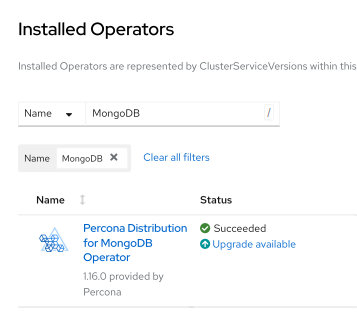

# Upgrade Database and Operator on OpenShift



Upgrading database and Operator on [Red Hat Marketplace :octicons-link-external-16:](https://marketplace.redhat.com) or to upgrade Red Hat certified Operators on [OpenShift :octicons-link-external-16:](https://www.redhat.com/en/technologies/cloud-computing/openshift) generally follows the [standard upgrade scenario](update.md), but includes a number of special steps specific for these platforms.

## Upgrading the Operator and CRD

1. First of all you need to manually update `initImage` Custom Resource option with the value of an alternative initial Operator installation image. You need doing this for all database clusters managed by the Operator. Without this step the cluster will go into error state after the Operator upgrade.

    1. Find the initial Operator installation image with `kubectl get deploy` command:

        ```bash
        kubectl get deploy percona-server-mongodb-operator -o yaml
        ```
    
        ??? example "Expected output"

            ``` {.text .no-copy}
            ...
            "containerImage": "registry.connect.redhat.com/percona/percona-server-mongodb-operator@sha256:201092cf97c9ceaaaf3b60dd1b24c7c5228d35aab2674345893f4cd4d9bb0e2e",
            ...
            ```

    2. [Apply a patch :octicons-link-external-16:](https://kubernetes.io/docs/tasks/run-application/update-api-object-kubectl-patch/) to update the `initImage` option of your cluster Custom Resource with this value taken from `containerImage`. Supposing that your cluster name is `my-cluster-name`, the command should look as follows:

        ```bash
        kubectl patch psmdb my-cluster-name --type=merge --patch '{
            "spec": {
               "initImage":"registry.connect.redhat.com/percona/percona-server-mongodb-operator@sha256:201092cf97c9ceaaaf3b60dd1b24c7c5228d35aab2674345893f4cd4d9bb0e2e"
            }}'
        ```

2. Now you can actually update the Operator via the [Operator Lifecycle Manager (OLM) :octicons-link-external-16:](https://docs.redhat.com/en/documentation/openshift_container_platform/4.2/html/operators/understanding-the-operator-lifecycle-manager-olm#olm-overview_olm-understanding-olm) web interface.

    Login to your OLM installation and list installed Operators for your Namespace to see if there are upgradable items:

    

    Click the "Upgrade available" link to see upgrade details, then click "Preview InstallPlan" button, and finally "Approve" to upgrade the Operator.

## Upgrading Percona Server for MongoDB

1. Make sure that `spec.updateStrategy` option in the [Custom Resource](operator.md)
    is set to `SmartUpdate`, `spec.upgradeOptions.apply` option is set to `Never`
    or `Disabled` (this means that the Operator will not carry on upgrades
    automatically).
    
    ```yaml
    ...
    spec:
      updateStrategy: SmartUpdate
      upgradeOptions:
        apply: Disabled
        ...
    ```

2. Find the **new** initial Operator installation image name (it had changed during the Operator upgrade) and other image names for the components of your cluster with the `kubectl get deploy` command:

    ```bash
    kubectl get deploy percona-server-mongodb-operator -o yaml
    ```

    ??? example "Expected output"

        ``` {.text .no-copy}
        ...
        "image": "registry.connect.redhat.com/percona/percona-server-mongodb-operator-containers@sha256:5d29132a60b89e660ab738d463bcc0707a17be73dc955aa8da9e50bed4d9ad3e",
        ...
        "initImage": "registry.connect.redhat.com/percona/percona-server-mongodb-operator@sha256:8adc57e9445cfcea1ae02798a8f9d6a4958ac89f0620b9c6fa6cf969545dd23f",
        ...
        "pmm": {
          "enabled": true,
          "image": "registry.connect.redhat.com/percona/percona-server-mongodb-operator-containers@sha256:165f97cdae2b6def546b0df7f50d88d83c150578bdb9c992953ed866615016f1",
        ...
        "backup": {
          "enabled": true,
          "image": "registry.connect.redhat.com/percona/percona-server-mongodb-operator-containers@sha256:a73889d61e996bc4fbc6b256a1284b60232565e128a64e4f94b2c424966772eb",
        ...
        ```

3. [Apply a patch :octicons-link-external-16:](https://kubernetes.io/docs/tasks/run-application/update-api-object-kubectl-patch/) to set the necessary `crVersion` value (equal to the Operator version) and update images in your cluster Custom Resource. Supposing that your cluster name is `cluster1`, the command should look as follows:


    ```bash
    kubectl patch psmdb my-cluster-name --type=merge --patch '{
        "spec": {
           "crVersion":"{{ release }}",
           "image": "registry.connect.redhat.com/percona/percona-server-mongodb-operator-containers@sha256:5d29132a60b89e660ab738d463bcc0707a17be73dc955aa8da9e50bed4d9ad3e",
           "initImage": "registry.connect.redhat.com/percona/percona-server-mongodb-operator@sha256:8adc57e9445cfcea1ae02798a8f9d6a4958ac89f0620b9c6fa6cf969545dd23f",
           "pmm": {"image": "registry.connect.redhat.com/percona/percona-server-mongodb-operator-containers@sha256:165f97cdae2b6def546b0df7f50d88d83c150578bdb9c992953ed866615016f1"},
           "backup": {"image": "registry.connect.redhat.com/percona/percona-server-mongodb-operator-containers@sha256:a73889d61e996bc4fbc6b256a1284b60232565e128a64e4f94b2c424966772eb"}
        }}'
    ```

    !!! warning

        The above command upgrades various components of the cluster including PMM Client. If you didn't follow the [official recommendation :octicons-link-external-16:](https://docs.percona.com/percona-monitoring-and-management/2/how-to/upgrade.html) to upgrade PMM Server before upgrading PMM Client, you can avoid PMM Client upgrade by removing it from the list of images as follows:

        ```bash
        kubectl patch psmdb my-cluster-name --type=merge --patch '{
            "spec": {
               "crVersion":"{{ release }}",
               "image": "registry.connect.redhat.com/percona/percona-server-mongodb-operator-containers@sha256:5d29132a60b89e660ab738d463bcc0707a17be73dc955aa8da9e50bed4d9ad3e",
               "initImage": "registry.connect.redhat.com/percona/percona-server-mongodb-operator@sha256:8adc57e9445cfcea1ae02798a8f9d6a4958ac89f0620b9c6fa6cf969545dd23f",
               "backup": {"image": "registry.connect.redhat.com/percona/percona-server-mongodb-operator-containers@sha256:a73889d61e996bc4fbc6b256a1284b60232565e128a64e4f94b2c424966772eb"}
            }}'
        ```

4. The deployment rollout will be automatically triggered by the applied patch.

