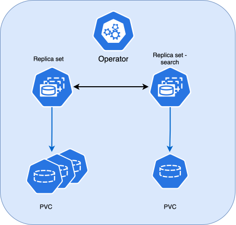
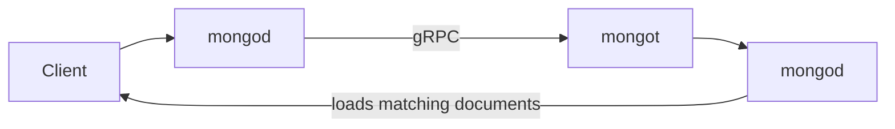
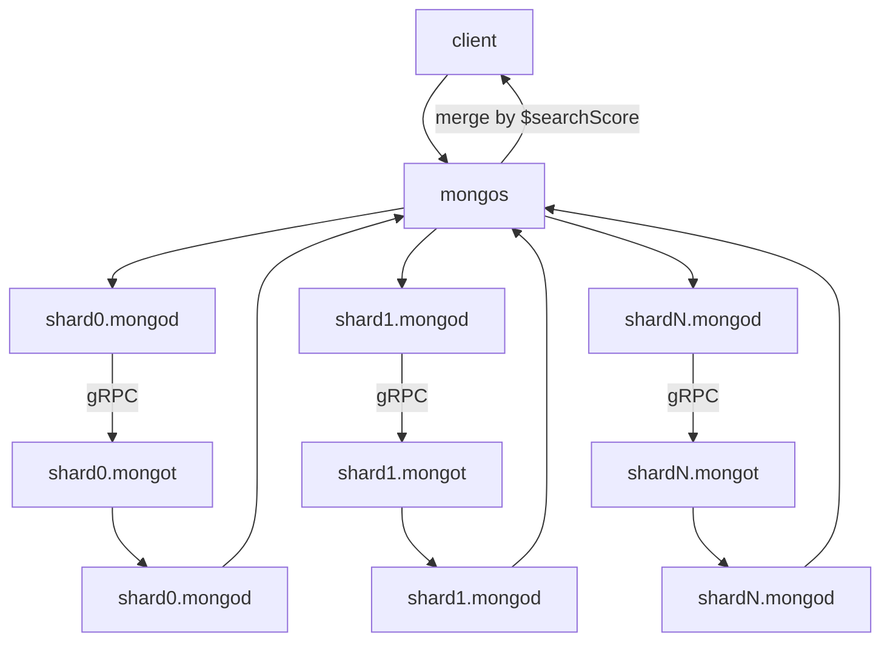

# Vector search

!!! admonition "Version added: [1.23.0](RN/Kubernetes-Operator-for-PSMONGODB-RN1.23.0.md)"

!!! warning "Tech preview"

    Vector search is in the tech preview stage. We don't recommend using it in
    production yet, but we encourage you to try it in a staging or testing
    environment and share your feedback. Your feedback helps us shape the
    feature in future releases.

[Vector search :octicons-link-external-16:](https://www.mongodb.com/docs/vector-search/)
is a search method that retrieves results based on meaning rather than exact
word matches. With vector search, you can store vector data (for example,
numerical representations of text, images, or other content) alongside
traditional data and run vector search queries in Percona Server for MongoDB
managed by the Operator.  

You get the same capability that MongoDB Atlas customers and
self-managed upstream users already have. The Operator automates the deployment and overall lifecycle of vector search, providing the same experience it offers for Percona Server for MongoDB clusters.

## What you can achieve with vector search

Typical use cases include:

* **Semantic search** — find documents that are close in meaning to a query,
  even when they don't share the same keywords
* **Hybrid search** — combine vector search with full-text search for richer
  ranking
* **Generative AI / RAG** — retrieve the most relevant context for large
  language models and AI agents from data already stored in MongoDB

[Configure vector search](vector-search-setup.md){.md-button}

## Architecture and components

Vector search is provided by a separate tool called Percona Search for MongoDB.
You manage vector search declaratively through the cluster Custom
Resource. 

When you enable vector search, the Operator deploys Percona Search for MongoDB as a dedicated
StatefulSet — one per data-bearing replica set or shard. 

The StatefulSet is
named `<cluster-name>-<rs-name>-search` and has its own PVC and headless Service. 

Existing deployments continue to work as before after you upgrade the
Operator: if you haven't enabled vector search for the cluster, the Operator does not deploy
search components.

## How the Percona Server for MongoDB (`mongod`) and Percona Search for MongoDB (`mongot`) communicate

Percona Search for MongoDB runs as a separate `mongot` process. Your applications never connect to it
directly. They still connect to Percona Server for MongoDB (to  `mongod` or to `mongos` in a sharded
cluster). The database acts as a proxy: it forwards search commands to
Percona Search for MongoDB (`mongot`), then returns the results to the client.

When a client runs `$search`, `$vectorSearch`, or `$searchMeta`, this is what
happens:

1. `mongod` forwards the query to `mongot` over [gRPC](https://grpc.io/).
2. `mongot` searches its indexes and returns matching document IDs and scores. It can use ANN (Approximate Nearest Neighbor) for faster approximate
results, or ENN (Exact Nearest Neighbor) for exact matches.
3. `mongod` loads the matching documents and sends them back to the client.

Each `mongot` serves one replica set (or one shard) and keeps search indexes
on its own persistent volume, separate from database data. Those indexes are
Lucene-style structures built for search workloads. Index *definitions* (what
to index) live in Percona Server for MongoDB while the index *data* lives on
Percona Search for MongoDB volume.

To stay in sync with the database, Percona Search for MongoDB opens a long-lived change-stream
connection to a `mongod` in the same replica set — usually a secondary — and
reads data changes as they happen.

So the connection works both ways:

* **`mongot` → `mongod`** — reads source data to build and refresh indexes
* **`mongod` → `mongot`** — forwards client search queries and index-management
  commands

### Replica set workflow

From the client's perspective, a vector search query looks like any other
aggregation against `mongod`:

1. The client sends a `$vectorSearch` (or `$search` / `$searchMeta`) aggregation
   to `mongod`.
2. `mongod` forwards the request to its bound `mongot` over gRPC.
3. `mongot` runs the search against its local indexes and returns matching
   document identifiers and scores.
4. `mongod` loads the corresponding documents and returns the result set to the
   client.

### Sharded cluster workflow

In a sharded cluster, the Operator deploys one `mongot` StatefulSet per shard.
`mongos` is the client entry point and coordinates cross-shard vector queries.
It scatter-gathers the search across shards and merges results by
`$searchScore`:

Each shard's `mongod` members point at that shard's `mongot`. For index
management, `mongos` is configured with the `mongot` endpoint of the first
shard (`shard0`).

## Authentication

When you enable vector search, the Operator creates a dedicated MongoDB system user with the built-in
`searchCoordinator` role. Credentials are
stored in the cluster users Secret under `MONGODB_SEARCH_USER` and
`MONGODB_SEARCH_PASSWORD`.

Percona Search for MongoDB uses this user to authenticate to `mongod` (and to `mongos` in sharded
clusters) over the cluster's existing internal authentication method. The
Operator does not require a separate auth mechanism for search.

When cluster TLS is enabled (the Operator default), Percona Search for MongoDB reuses the
cluster's internal TLS material. The Operator extends the TLS certificate SANs so they cover the  `<cluster>-<rs>-search` Service names.

Don't use the `searchCoordinator` system user from your applications. Create
application users with the privileges your workloads need, the same as for any
other MongoDB feature.

## Backups and restores

Percona Backup for MongoDB (PBM) does **not** back up Percona Search for MongoDB PVCs. Search
indexes are derivable from `mongod` data through change streams, so only
database data is included in backups.

After a PBM restores `mongod` data, the Operator restarts Percona Search for MongoDB pods. Each new Percona Search for MongoDB Pod performs a full initial sync from the restored `mongod` and
   rebuilds its indexes.

Restore completion does **not** wait for Percona Search for MongoDB to become ready. Database
availability returns when the restore finishes; search availability is eventual
and depends on how long index rebuild takes for your dataset.

## Observability and metrics

You can scrape metrics from the headless search Service
(`<cluster>-<rs>-search`) on port `9946`. Dedicated PMM dashboards for `mongot`
are not included in this tech preview; use the metrics endpoint with your
existing Prometheus-compatible stack, and watch `status.search` on the cluster
Custom Resource for readiness.

## Availability and requirements

To use vector search with the Operator, you must meet the following
requirements:

1. **Percona Server for MongoDB 8.3 or later.** Vector search is available only
   starting with MongoDB 8.3. The Operator uses [experimental
   images of Percona Server for MongoDB 8.3](https://hub.docker.com/r/perconalab/percona-server-mongodb/tags?name=8.3). You must explicitly specify them in
   the Custom Resource to use vector search. 
2. **Dedicated persistent storage for each Percona Search for MongoDB pod.** Each Percona Search for MongoDB needs
   its own PVC; volumes cannot be shared. Index data is typically about 0.25×–2×
   the source data size, with 2× headroom recommended for rebuilds. Percona Search for MongoDB 
   becomes read-only at about 90% disk usage. The default PVC size of `10Gi` is
   enough for small datasets; tune storage for larger workloads.
3. **Resource requirements**. The Operator follows upstream [resource requirements :octicons-link-external-16:](https://www.mongodb.com/docs/vector-search/deployment/deployment-options/#resource-usage)
4. **Kubernetes resources.** Default requests are 2 CPU and 2Gi memory per
   Percona Search for MongoDB pod. Size resources for your index and query load.

## Implementation specifics

* One Percona Search for MongoDB deployment per data-bearing replica set (or per shard in a
  sharded cluster).
* The config server replica set has no Percona Search for MongoDB StatefulSet.
* The Operator injects the required `setParameter` values that point to the search endpoint into `mongod` and
  `mongos` configuration. Operator-managed keys override conflicting user values
  so the search endpoint does not drift.
* You configure cluster-wide defaults under `spec.search` and can fine-tune
  resources, storage, and placement per replica set or shard with
  `spec.replsets[].search`. Enable/disable, image, and raw Percona Search for MongoDB
  configuration stay cluster-wide.
* You can supply a partial Percona Search for MongoDB YAML under `spec.search.configuration`. The
  Operator merges it onto the generated defaults and overrides only the fields
  you set.
* Cluster status exposes `status.search` keyed by replica set or shard name
  (`size`, `ready`, `status`, `message`). Read more about available statuses in [Custom resource statuses](cr-statuses.md)

## Limitations

* **Single Percona Search for MongoDB pod per replica set or shard.** The search StatefulSet is
  limited to `size: 1`. Kubernetes `Service` ClusterIP load balancing is L4-only
  and cannot correctly distribute long-lived gRPC streams across multiple
  backends. Multi-replica Percona Search for MongoDB HA (which needs an L7 gRPC-aware load
  balancer) is postponed to a later release.
* **No automated embedding.** Generating and managing embeddings through an
  external embedding API (for example automated / Voyage AI embedding) is not supported. You provide and store vector embeddings yourself.
* **No migration from externally managed `mongot`.** Deployments that already
  run `mongot` outside the Operator are not imported. Manage them manually, or
  switch to Operator-managed vector search.
* **Logical restores on sharded clusters with MongoDB 8.3 can leave the
  cluster broken.** This is a known PBM limitation tracked in
  [PBM-1764 :octicons-link-external-16:](https://perconadev.atlassian.net/browse/PBM-1764).
* **Search indexes are not included in backups.** Plan for reindex time after
  restore when you estimate recovery objectives for the search surface.

